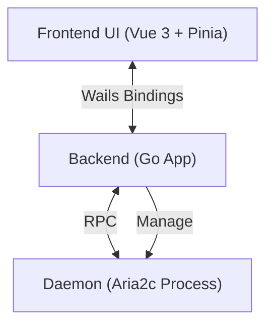

<div align="center">
  <picture>
    <source media="(prefers-color-scheme: dark)" srcset="frontend/src/assets/icons/dark.svg">
    
  </picture>
  <h1>GoAria v3</h1>
  <p>
    <strong>轻量、纯净的 Aria2c 原生下载界面</strong>
  </p>
  <p>
    告别繁琐的命令行，让下载回归简单与优雅。
  </p>

  <p>
    <a href="https://golang.org/">
      
    </a>
    <a href="https://wails.io">
      
    </a>
    <a href="https://vuejs.org/">
      
    </a>
    <a href="https://tailwindcss.com/">
      
    </a>
  </p>

  <p>
    <a href="./README.md">简体中文</a> | <a href="./README_EN.md">English</a>
  </p>
</div>

## 📖 简介

**GoAria** 是基于 [Wails v3](https://wails.io) 构建的现代化 Aria2 图形界面。

与追求全功能的下载器不同，GoAria 的哲学是**实用主义**与**零干扰**。我们剔除了磁力链接等复杂功能，专注于提升 link（HTTP/HTTPS/FTP）下载的效率。它不仅仅是一个壳，而是一个经过深度优化的生产力工具，旨在以极低的资源占用，提供原生应用级的操作手感

<div align="center">
  
  <p><em>深色模式：黑曜石与激光的视觉交响</em></p>
</div>

## ✨ 核心特性

### 🎯 专注于下载

- **精简核心**: 专注处理 HTTP/HTTPS/FTP/SFTP 链接，不包含磁力、种子等冗余模块，保持功能纯粹。
- **Spotlight 交互**: 类似系统级搜索的标题栏设计，支持链接自动识别，一键开始任务。
- **智能线程**: 根据文件大小智能计算最优线程数，避免资源浪费。

### 🚀 极致轻量

- **低资源占用**: 基于 Go 与 Wails v3，占用存储空间极小。
- **极小分发体积**: 经过 UPX 压缩后的成品仅约 **10MB**，开箱即用，轻快如风。
- **智能轮询控制**: 当窗口隐藏时自动优化 API 请求频率，尊重你的 CPU 和电量。
- **轻量模式**: 支持无头模式，无 UI，仅作为 Aria2 的前端，通过 RPC 与 Aria2 交互。可通过命令行参数 `--hidden` 来直接启动无头模式。

### 🎨 现代美学 (Aesthetics)

- **原生沉浸**: 深度适配 Windows 11 Mica / Acrylic 材质，支持自定义皮肤（黑曜石与激光 / 电子纸与陶瓷）。
- **智慧交互**: 灵感源自 Spotlight 的一键抓取设计，通过动态光效而非枯燥文字传达任务状态。
- **极致流畅**: 虚拟滚动技术加持，处理上千个任务依旧丝滑无感。

## 🛠️ 技术架构

GoAria 采用 **Frontend-Backend-Daemon** 三层架构，确保稳定性与扩展性。



- **Frontend**: 负责极致的 UI/UX 呈现。
- **Backend**: 处理业务逻辑，作为 Aria2 与 UI 的桥梁，确保持久化与系统集成。
- **Daemon**: 内置 Aria2 二进制，开箱即用，无需额外配置。

## 💻 开发指南

确保您的系统已安装 Go 1.25+ 和 Node.js 18+。

### ⚡ 快速设置 (Windows)

我们提供了一个脚本来自动准备开发环境（安装 Wails3，下载 Aria2 内核等）。注意甄别您下载的脚本来源，确保其来自官方仓库。

```powershell
powershell -ExecutionPolicy Bypass -File .\setup.ps1
```

### 手动设置

```bash
# 克隆项目
git clone https://github.com/superGekFordJ/goaria-v3.git
cd goaria-v3

# 我们推荐使用 pnpm，如果没有安装的话
# cd frontend
# corepack enable
# corepack prepare pnpm@latest --activate
# corepack use pnpm

# 安装依赖
wails3 task deps:update:frontend
wails3 task deps:update:go


# 启动开发模式 (支持热重载)
wails3 dev

# 构建生产版本
wails3 build
```

## 📄 许可证

[MIT License](LICENSE)
