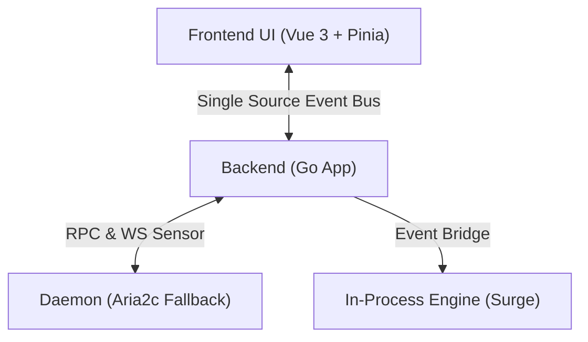

<div align="center">
  <picture>
    <source media="(prefers-color-scheme: dark)" srcset="frontend/src/assets/icons/dark.svg">
    
  </picture>
  <h1>GoAria v3</h1>
  <p>
    <strong>轻量、纯净的 Aria2c 原生下载界面</strong>
  </p>
  <p>
    告别繁琐的命令行，让下载回归简单与优雅。
  </p>

  <p>
    <a href="https://golang.org/">
      
    </a>
    <a href="https://wails.io">
      
    </a>
    <a href="https://vuejs.org/">
      
    </a>
    <a href="https://tailwindcss.com/">
      
    </a>
  </p>

  <p>
    <a href="https://addons.mozilla.org/addon/goaria">
      
    </a>
    <a href="https://microsoftedge.microsoft.com/addons/detail/goaria/ofjjbleopjcflpbdnklpdnchbmkkicfd">
      
    </a>
  </p>

  <p>
    <a href="./README.md">简体中文</a> | <a href="./README_EN.md">English</a>
  </p>
</div>

## 📖 简介

**GoAria** 是基于 [Wails v3](https://wails.io) 构建的现代化极速下载器。从 v3.0 开始，GoAria 迎来了重大的双核架构升级：我们在保留 `aria2c` 作为后备引擎与 RPC 接口的同时，引入了由 SurgeDM 团队打造的内置 `surge` 引擎作为 HTTP(S) 的新默认下载核心，并搭载了更加智能的**线程调度大脑**。

与追求全功能的传统下载器不同，GoAria 的哲学是**实用主义**与**零干扰**。全新的底层架构能根据历史测速与实时网络状况动态分配最优线程，旨在以极低的资源占用，提供原生应用级的操作手感与大幅跃升的单线程效率。

<div align="center">
  
  <p><em>深色模式：黑曜石与激光的视觉交响</em></p>
</div>

## ✨ 核心特性

### 🚀 更加智能的自适应引擎

- **双核无缝切换**: 默认采用内联 `surge` 引擎处理 HTTP(S) 下载，获取极致速度；同时完整保留 `aria2c` 进程作为其它协议的可靠回退选项。
- **更加智能的线程调度**: 引擎会实时监测网络状况，结合历史预判自动为您计算每一个任务的最优并发数，彻底告别手动猜线程的烦恼。
- **单线程效率飞跃**: 极致优化的底层架构与分级内存池机制，配合极低 IPC 成本的纯事件驱动设计，带来了超越传统下载工具的单线程性能。
- **内网极速打满**: 针对 Windows 重构预分配机制，瞬间打满 2.5Gbps 物理网卡上限。
- **智能组下载**: 批量添加的链接自动归档至专属文件夹，并在任务列表中聚合为单一“组卡片”，支持一键全组控制与后台清理。

### 🚀 极致轻量

- **低资源占用**: 基于 Go 与 Wails v3，底层开销极低。
- **内嵌 Surge 原生引擎**: 采用内嵌编译与零 IPC 进程损耗设计，彻底告别传统跨进程通信造成的性能与上下文切换瓶颈。
- **真·纯后台极低驻留**: 支持最小化/托盘纯后台静默运行，常规后台待机内存占用压缩至约 **20MB**。
- **纯粹事件驱动与零无效唤醒**: 全面采用事件信使推送机制，告别传统高频轮询。无 Aria2 任务时自动休眠，仅在状态真实变动时按需通知，彻底消除待机功耗。

### 🧊 现代液态玻璃美学

- **原生沉浸**: 深度适配 Windows 11 Mica / Acrylic 材质，支持自定义皮肤（黑曜石与激光 / 电子纸与陶瓷）。
- **液态玻璃特效**: 统一的高级“液态玻璃”视觉组件，提供更灵动且具质感的交互反馈，并智能响应系统“减弱动态效果”模式以节能。
- **智慧交互**: 灵感源自 Spotlight 的一键抓取设计，通过动态光效而非枯燥文字传达任务状态。
- **极致流畅**: 虚拟滚动技术加持，处理上千个任务依旧丝滑无感。
- **官方浏览器扩展**: 首个无缝接管浏览器请求的扩展即将上线，为您提供极致顺滑的下载接力体验。

## 🛠️ 技术架构

GoAria 采用 **Frontend-Backend-Daemon** 三层架构，确保稳定性与扩展性。



- **Frontend**: 负责极致的液态玻璃 UI/UX 呈现。
- **Backend**: 作为中央 Hub 聚合来自 Surge 与 Aria2 的状态，通过单源信使（Single Source Event Bus）将事件统一推送至前端。
- **Dual Engines**: `surge` 作为内置极速 HTTP(S) 引擎；`aria2c` 作为独立进程提供跨协议兼容与原生 RPC 接口。

## 💻 开发指南

确保您的系统已安装 Go 1.26+ 和 Node.js 22+。

### ⚡ 快速设置

我们提供了自动化脚本来快速准备开发环境（检查工具链、安装依赖并准备 Aria2 内核等）：

**Windows (PowerShell):**

```powershell
powershell -ExecutionPolicy Bypass -File .\setup.ps1
```

**Linux / macOS (Bash):**

```bash
chmod +x setup.sh
./setup.sh
```

### 手动设置

```bash
# 克隆项目
git clone https://github.com/superGekFordJ/goaria-v3.git
cd goaria-v3

# 我们推荐使用 pnpm，如果没有安装的话
# cd frontend
# corepack enable
# corepack prepare pnpm@latest --activate
# corepack use pnpm

# 安装依赖
wails3 task deps:update:frontend
wails3 task deps:update:go


# 启动开发模式 (支持热重载)
wails3 dev

# 构建生产版本
wails3 task build

# 如需打包产物
wails3 task package
```

> Linux / macOS 构建说明：发布产物现在同时内置了 `surge` 引擎与 `aria2c`。本地构建/打包流程仍会强制准备可嵌入的 `aria2c`。原生构建器可直接安装系统 `aria2c` 后运行 `wails3 task linux:prepare:aria2` 或 `wails3 task darwin:prepare:aria2`。

## 📄 许可证

[MIT License](LICENSE)
