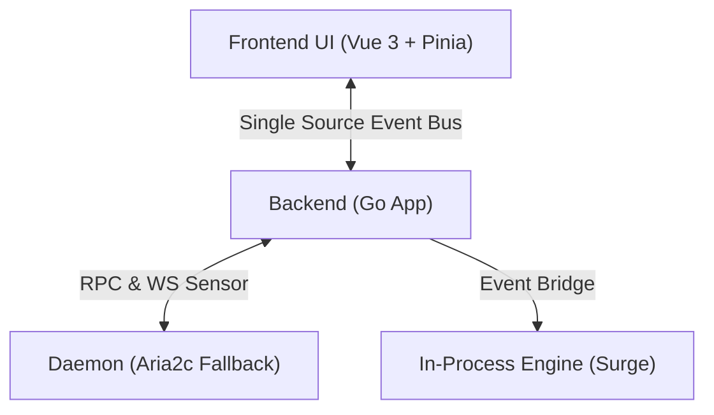

<div align="center">
  <picture>
    <source media="(prefers-color-scheme: dark)" srcset="frontend/src/assets/icons/dark.svg">
    
  </picture>
  <h1>GoAria v3</h1>
  <p>
    <strong>A Lightweight, Pure Native UI for Aria2c and Surge</strong>
  </p>
  <p>
    Stay focused. Return to the essence of downloading.
  </p>

  <p>
    <a href="https://golang.org/">
      
    </a>
    <a href="https://wails.io">
      
    </a>
    <a href="https://vuejs.org/">
      
    </a>
    <a href="https://tailwindcss.com/">
      
    </a>
  </p>

  <p>
    <a href="./README.md">简体中文</a> | <a href="./README_EN.md">English</a>
  </p>
</div>

## 📖 Introduction

**GoAria** is a modern graphical interface for Aria2 and Surge, built on [Wails v3](https://wails.io). Starting from v3.0, GoAria introduces a major dual-core architecture upgrade: while retaining `aria2c` as a fallback engine and keeping its RPC interface, we integrated the built-in `surge` engine (by SurgeDM) as the new default for HTTP(S), powered by a much smarter **thread scheduling brain**.

Unlike feature-heavy traditional download managers, GoAria's philosophy is rooted in **Pragmatism** and **Zero Interference**. The new architecture dynamically allocates optimal threads based on historical speeds and real-time conditions. It is designed to deliver a native app experience and significantly improved single-thread efficiency with minimal system resource consumption.

<div align="center">
  <!-- Replace with your actual application screenshot -->
  
  <p><em>Dark Mode: A visual symphony of Obsidian and Laser</em></p>
</div>

## ✨ Key Features

### 🚀 Smarter Adaptive Engine

- **Seamless Dual-Core**: Uses the inline `surge` engine by default for blazing-fast HTTP(S) downloads, while fully retaining the `aria2c` daemon as a reliable fallback for other protocols.
- **Smarter Thread Scheduling**: The engine monitors real-time network conditions and historical data to automatically calculate the optimal concurrency for each task. No more guessing threads manually.
- **Leap in Single-Thread Efficiency**: The highly optimized architecture and tiered buffer pool, combined with a pure event-driven design featuring extremely low IPC costs, deliver single-thread performance surpassing traditional tools.
- **LAN Saturation**: Completely refactored pre-allocation mechanism for Windows, instantly saturating the 2.5Gbps physical network card ceiling.
- **Smart Grouping**: Batch downloads are automatically grouped into dedicated folders and condensed into a single "Group Card" for one-click management and background cleanup.


### 🚀 Extreme Lightweight

- **Low Resource Usage**: Built with Go and Wails v3, ensuring minimal storage space.
- **Tiny Distribution**: The final binary is approximately **10MB** after UPX compression. Portable and blazing fast.
- **Smart Polling**: Automatically optimizes API request frequency when the window is hidden to respect your CPU and battery life.
- **Lightweight Mode**: Support headless mode, no UI, only as Aria2 frontend, through RPC with Aria2 interaction. You can use `--hidden` to directly start headless mode.

### 🧊 Liquid Glass Aesthetics


- **Native Immersion**: Seamlessly integrates with Windows 11 Mica / Acrylic materials, blending into your desktop environment.
- **Liquid Glass Visuals**: Premium unified "Liquid Glass" components for dynamic interaction feedback, with smart support for "reduced motion" mode for energy efficiency.
- **Intuitive Feedback**: Moves away from verbose text labels, using elegant breathing light effects and color transitions to communicate task status.
- **Fluid Performance**: Leverages Virtual Scroller technology to maintain 60FPS scrolling even with thousands of tasks.
- **Official Browser Extension**: Our first extension seamlessly takes over browser requests, ensuring your download relay is smooth and uninterrupted.

## 🛠️ System Architecture

GoAria adopts a **Frontend-Backend-Daemon** three-tier architecture to ensure stability and extensibility.



- **Frontend**: Responsible for the ultimate Liquid Glass UI/UX presentation.
- **Backend**: Acts as a central Hub aggregating statuses from both Surge and Aria2, pushing unified events to the frontend via a Single Source Event Bus.
- **Dual Engines**: `surge` acts as the built-in ultra-fast HTTP(S) core; `aria2c` runs as a daemon ensuring protocol compatibility and preserving the native RPC interface.

## 💻 Development Guide

Ensure your system has Go 1.25+ and Node.js 18+ installed.

### ⚡ Quick Setup (Windows)

We provide a script to automatically verify the environment and download the Aria2 core.

```powershell
powershell -ExecutionPolicy Bypass -File .\setup.ps1
```

### Manual Setup

```bash
# Clone the project
git clone https://github.com/superGekFordJ/goaria-v3.git
cd goaria-v3

# We recommend using pnpm. If not installed:
# cd frontend
# corepack enable
# corepack prepare pnpm@latest --activate
# corepack use pnpm

# Install dependencies
wails3 task deps:update:frontend
wails3 task deps:update:go

# Start dev mode (supports hot reload)
wails3 dev

# Build production version
wails3 task build

# Package distributable artifacts when needed
wails3 task package
```

> Linux / macOS build note: Shipped artifacts now bundle both the new `surge` engine and the `aria2c` daemon. Local build/package flows still require preparing a bundleable `aria2c` before compilation proceeds by running `wails3 task linux:prepare:aria2` or `wails3 task darwin:prepare:aria2` on native builders.

## 📄 License

[MIT License](LICENSE)
