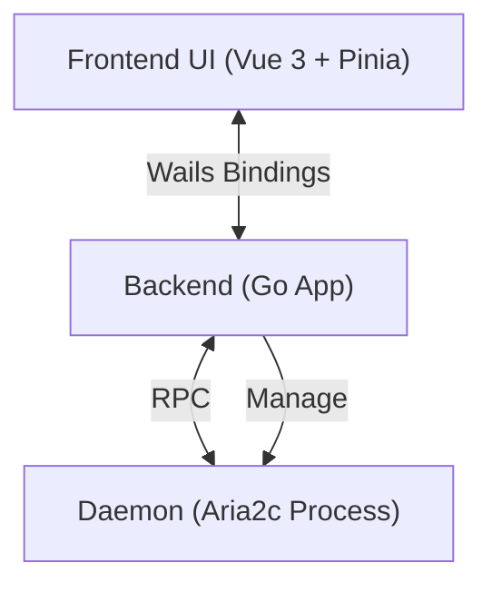

<div align="center">
  <picture>
    <source media="(prefers-color-scheme: dark)" srcset="frontend/src/assets/icons/dark.svg">
    
  </picture>
  <h1>GoAria v3</h1>
  <p>
    <strong>A Lightweight, Pure Native UI for Aria2c</strong>
  </p>
  <p>
    Stay focused. Return to the essence of downloading.
  </p>

  <p>
    <a href="https://golang.org/">
      
    </a>
    <a href="https://wails.io">
      
    </a>
    <a href="https://vuejs.org/">
      
    </a>
    <a href="https://tailwindcss.com/">
      
    </a>
  </p>

  <p>
    <a href="./README.md">简体中文</a> | <a href="./README_EN.md">English</a>
  </p>
</div>

## 📖 Introduction

**GoAria** is a modern graphical interface for Aria2, built on [Wails v3](https://wails.io).

Unlike feature-heavy download managers, GoAria's philosophy is rooted in **Pragmatism** and **Zero Interference**. We have consciously excluded complex features like magnet links and torrents to focus entirely on the efficiency of link-based (HTTP/HTTPS/FTP) downloads. It is a deeply optimized productivity tool designed to deliver a native app experience with minimal system resource consumption.

<div align="center">
  <!-- Replace with your actual application screenshot -->
  
  <p><em>Dark Mode: A visual symphony of Obsidian and Laser</em></p>
</div>

## ✨ Key Features

### 🎯 Focused Downloading

- **Streamlined Core**: Exclusively handles HTTP/HTTPS/FTP/SFTP links. No bloat from magnet or torrent modules, keeping the functionality pure.
- **Spotlight Interaction**: A system-level search inspired header design with automatic link recognition for one-click task initiation.

### 🚀 Extreme Lightweight

- **Low Resource Usage**: Built with Go and Wails v3, ensuring minimal storage space.
- **Tiny Distribution**: The final binary is approximately **10MB** after UPX compression. Portable and blazing fast.
- **Smart Polling**: Automatically optimizes API request frequency when the window is hidden to respect your CPU and battery life.

### 🎨 Zero-Interference Aesthetics

- **Native Immersion**: Seamlessly integrates with Windows 11 Mica / Acrylic materials, blending into your desktop environment.
- **Intuitive Feedback**: Moves away from verbose text labels, using elegant breathing light effects and color transitions to communicate task status.
- **Fluid Performance**: Leverages Virtual Scroller technology to maintain 60FPS scrolling even with thousands of tasks.

## 🛠️ System Architecture

GoAria adopts a **Frontend-Backend-Daemon** three-tier architecture to ensure stability and extensibility.



- **Frontend**: Responsible for ultimate UI/UX presentation.
- **Backend**: Handles business logic, acts as a bridge between Aria2 and UI, ensuring persistence and system integration.
- **Daemon**: Built-in Aria2 binary, works out of the box with no extra configuration needed.

## 💻 Development Guide

Ensure your system has Go 1.25+ and Node.js 18+ installed.

### ⚡ Quick Setup (Windows)

We provide a script to automatically verify the environment and download the Aria2 core.

```powershell
powershell -ExecutionPolicy Bypass -File .\setup.ps1
```

### Manual Setup

```bash
# Clone the project
git clone https://github.com/superGekFordJ/goaria-v3.git
cd goaria-v3

# We recommend using pnpm. If not installed:
# cd frontend
# corepack enable
# corepack prepare pnpm@latest --activate
# corepack use pnpm

# Install dependencies
wails3 task deps:update:frontend
wails3 task deps:update:go

# Start dev mode (supports hot reload)
wails3 dev

# Build production version
wails3 build
```

## 📄 License

[MIT License](LICENSE)
