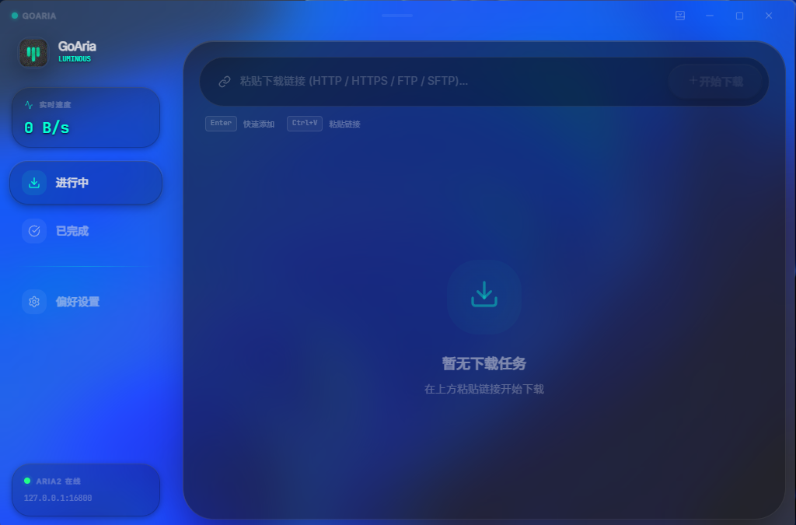
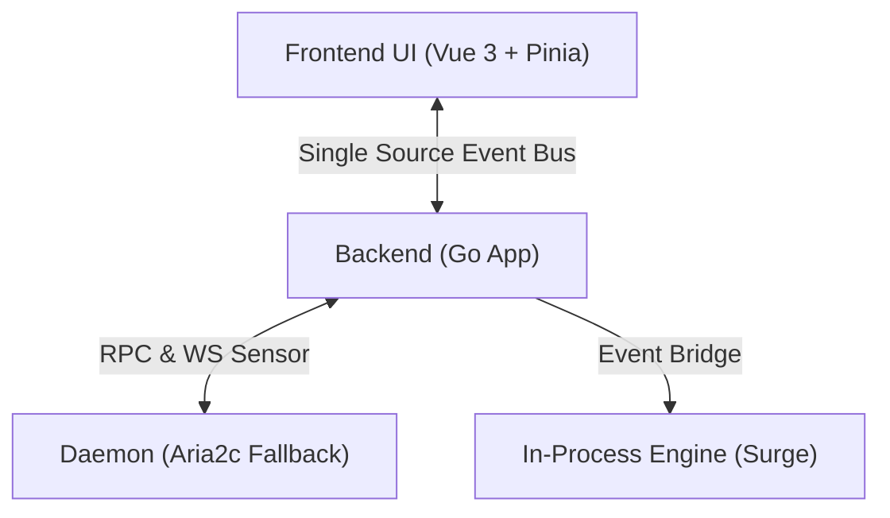

<div align="center">
  <picture>
    <source media="(prefers-color-scheme: dark)" srcset="frontend/src/assets/icons/dark.svg">
    
  </picture>
  <h1>GoAria v3</h1>
  <p>
    <strong>Native Dual-Engine Architecture · Adaptive Thread Prediction · Liquid Glass Aesthetics</strong>
  </p>
  <p>
    Inferring optimal concurrency through adaptive link heuristics for peak throughput and zero-configuration simplicity.
  </p>

  <p>
    <a href="https://golang.org/">
      
    </a>
    <a href="https://wails.io">
      
    </a>
    <a href="https://vuejs.org/">
      
    </a>
    <a href="https://tailwindcss.com/">
      
    </a>
  </p>

  <p>
    <a href="https://addons.mozilla.org/addon/goaria">
      
    </a>
    <a href="https://microsoftedge.microsoft.com/addons/detail/goaria/ofjjbleopjcflpbdnklpdnchbmkkicfd">
      
    </a>
  </p>

  <p>
    <a href="./README.md">简体中文</a> | <a href="./README_EN.md">English</a>
  </p>
</div>

## 📖 Introduction

**GoAria** is a modern, high-performance download manager built on [Wails v3](https://wails.io). Starting from v3.0, GoAria introduces a major dual-engine architecture upgrade: while retaining `aria2c` as a reliable fallback and standard RPC interface, it deeply integrates the in-process native `surge` engine optimized for HTTP(S), coupled with an **adaptive thread prediction system**.

GoAria is designed around the principles of **Pragmatism** and **Zero Interference**. Traditional static concurrency models often compromise between network congestion and bandwidth underutilization. By analyzing historical speed metrics and server response patterns, GoAria dynamically computes the optimal thread count and chunk granularity the moment a task begins—maximizing bandwidth saturation while preventing server rate-limits. Combined with a native Liquid Glass interface and minimal resource footprint, it provides a clean, refined, and exceptionally fast download experience.

<div align="center">
  <!-- Replace with your actual application screenshot -->
  
  <p><em>Dark Mode: A visual symphony of Obsidian and Laser</em></p>
</div>

## ✨ Key Features

### 🧠 Intelligent Adaptive Thread Scheduling

- **Link-Aware Concurrency Prediction**: Calculates optimal thread counts and chunk sizes in milliseconds using historical speed records and host response metrics, achieving peak throughput without manual parameter tuning.
- **Native Dual-Engine Synergy**: HTTP(S) downloads run through the embedded native `surge` engine to eliminate IPC overhead, while the standalone `aria2c` daemon serves as a reliable fallback and ecosystem RPC bridge.
- **Enhanced Single-Thread & Concurrency Efficiency**: Optimized tiered memory pools and pure event-driven IPC significantly boost single-thread throughput, easily saturating 2.5Gbps network hardware.
- **Fast Windows Pre-allocation**: Completely refactored pre-allocation mechanism for Windows, substantially reducing initialization delays for large files.
- **Smart Task Grouping**: Batch tasks are automatically organized into dedicated directories and condensed into collapsible group cards for streamlined management.


### 🚀 Extreme Lightweight

- **Minimal Resource Footprint**: Built with Go and Wails v3, delivering near-zero runtime overhead.
- **Embedded In-Process Engine**: Features an embedded compilation and zero-IPC design with Surge, completely eliminating inter-process communication bottlenecks and context-switching overhead.
- **True Headless Background Efficiency**: Seamlessly runs silently in the background/system tray with idle memory footprint compressed to around **20MB**.
- **Pure Event-Driven & Zero Idle Wakeups**: Fully driven by the in-process Event Bridge, eradicating traditional high-frequency busy-polling. Automatically sleeps when no Aria2 tasks exist and updates only on real state changes, effectively eliminating standby power drain.

### 🧊 Liquid Glass Aesthetics

- **Native Immersion**: Seamlessly integrates with Windows 11 Mica / Acrylic materials, blending into your desktop environment.
- **Liquid Glass Visuals**: Premium unified "Liquid Glass" components for dynamic interaction feedback, with smart support for "reduced motion" mode for energy efficiency.
- **Intuitive Feedback**: Moves away from verbose text labels, using elegant breathing light effects and color transitions to communicate task status.
- **Fluid Performance**: Leverages Virtual Scroller technology to maintain 60FPS scrolling even with thousands of tasks.
- **Official Browser Extension**: Our first extension seamlessly takes over browser requests, ensuring your download relay is smooth and uninterrupted.

## 🛠️ System Architecture

GoAria adopts a **Frontend-Backend-Daemon** three-tier architecture to ensure stability and extensibility.



- **Frontend**: Responsible for the ultimate Liquid Glass UI/UX presentation.
- **Backend**: Acts as a central Hub aggregating statuses from both Surge and Aria2, pushing unified events to the frontend via a Single Source Event Bus.
- **Dual Engines**: `surge` acts as the built-in ultra-fast HTTP(S) core; `aria2c` runs as a daemon ensuring protocol compatibility and preserving the native RPC interface.

## 💻 Development Guide

Ensure your system has Go 1.26+ and Node.js 22+ installed.

### ⚡ Quick Setup

We provide automated setup scripts to prepare your development environment (check toolchains, install dependencies, and stage Aria2 binaries):

**Windows (PowerShell):**

```powershell
powershell -ExecutionPolicy Bypass -File .\setup.ps1
```

**Linux / macOS (Bash):**

```bash
chmod +x setup.sh
./setup.sh
```

### Manual Setup

```bash
# Clone the project
git clone https://github.com/superGekFordJ/goaria-v3.git
cd goaria-v3

# We recommend using pnpm. If not installed:
# cd frontend
# corepack enable
# corepack prepare pnpm@latest --activate
# corepack use pnpm

# Install dependencies
wails3 task deps:update:frontend
wails3 task deps:update:go

# Start dev mode (supports hot reload)
wails3 dev

# Build production version
wails3 task build

# Package distributable artifacts when needed
wails3 task package
```

> Linux / macOS build note: Shipped artifacts now bundle both the new `surge` engine and the `aria2c` daemon. Local build/package flows still require preparing a bundleable `aria2c` before compilation proceeds by running `wails3 task linux:prepare:aria2` or `wails3 task darwin:prepare:aria2` on native builders.

## 📄 License

[MIT License](LICENSE)
