# GoAria BBR 自适应调度引擎技术白皮书

## GoAria BBR-Informed Adaptive Scheduling Engine Technical Whitepaper

- [第一章：摘要与行业痛点 (Abstract & Industry Pain Points)](#第一章摘要与行业痛点-abstract--industry-pain-points)
  - [§1.1 摘要](#11-摘要)
  - [§1.2 Bufferbloat 理论动机](#12-bufferbloat-理论动机)
  - [§1.3 静态多线程的困局](#13-静态多线程的困局)
  - [§1.4 BBR 的启示](#14-bbr-的启示)
  - [§1.5 反论防御：为何不用 TCP 层 BBR？](#15-反论防御为何不用-tcp-层-bbr)
- [第二章：代数化简的 BBR 模型 (Algebraically Simplified BBR Model)](#第二章代数化简的-bbr-模型-algebraically-simplified-bbr-model)
  - [§2.1 BBR 理论基础与 BDP 公式](#21-bbr-理论基础与-bdp-公式)
  - [§2.2 代数化简：RTprop 的消去](#22-代数化简rtprop-的消去)
  - [§2.3 操作形式：从 BDP 到 V_target/V_thread_avg](#23-操作形式从-bdp-到-v_targetv_thread_avg)
  - [§2.4 双天花板模型与全局带宽感知](#24-双天花板模型与全局带宽感知)
  - [§2.5 降级矩阵](#25-降级矩阵)
  - [§2.6 理论与工程的边界](#26-理论与工程的边界)
  - [§2.7 策略-机制隔离原则（概述）](#27-策略-机制隔离原则概述)
- [第三章：环境感知与自适应收敛 (Environment Awareness & Adaptive Convergence)](#第三章环境感知与自适应收敛-environment-awareness--adaptive-convergence)
  - [§3.1 网关 MAC Hash 物理隔离](#31-网关-mac-hash-物理隔离)
  - [§3.2 采样存储与查询 API](#32-采样存储与查询-api)
  - [§3.3 Tracker 引导的初始线程数](#33-tracker-引导的初始线程数)
  - [§3.4 跨下载收敛轨迹](#34-跨下载收敛轨迹)
  - [§3.5 51dee21 Preallocate Fix 与数据有效性](#35-51dee21-preallocate-fix-与数据有效性)
  - [§3.6 冷启动 vs 热启动：寻找真正的学习主证据](#36-冷启动-vs-热启动寻找真正的学习主证据)
- [第四章：运行时多重兜底 (Runtime Multi-Layer Fallback)](#第四章运行时多重兜底-runtime-multi-layer-fallback)
  - [§4.1 ConvergenceTicker 比率纠偏](#41-convergenceticker-比率纠偏)
  - [§4.2 轻量排空：Drain over Kill](#42-轻量排空drain-over-kill)
  - [§4.3 终局模式：End-Game Hedge](#43-终局模式end-game-hedge)
  - [§4.4 服务端连接硬限熔断](#44-服务端连接硬限熔断)
  - [§4.5 带宽借用](#45-带宽借用)
  - [§4.6 分级内存池](#46-分级内存池)
  - [§4.7 CDN 节流指纹与微观循环](#47-cdn-节流指纹与微观循环)
  - [§4.8 反论防御](#48-反论防御)
- [第五章：策略与机制的隔离哲学 (Policy-Mechanism Separation Philosophy)](#第五章策略与机制的隔离哲学-policy-mechanism-separation-philosophy)
  - [§5.1 隔离原则的架构基础](#51-隔离原则的架构基础)
  - [§5.2 双环自适应：宏观与微观](#52-双环自适应宏观与微观)
  - [§5.3 隔离原则的工程价值](#53-隔离原则的工程价值)
- [第六章：实测验证与数据解读 (Benchmark Validation & Data Interpretation)](#第六章实测验证与数据解读-benchmark-validation--data-interpretation)
  - [§6.1 测试方法论](#61-测试方法论)
  - [§6.2 广域网高带宽基线](#62-广域网高带宽基线)
  - [§6.3 CDN 拥塞与断路器](#63-cdn-拥塞与断路器)
  - [§6.4 局域网极速吞吐](#64-局域网极速吞吐)
  - [§6.5 每线程效率汇总](#65-每线程效率汇总)
  - [§6.6 收敛轨迹汇总](#66-收敛轨迹汇总)
  - [§6.7 特殊事件](#67-特殊事件)
  - [§6.8 实证局限与数据边界声明](#68-实证局限与数据边界声明)
- [第七章：结语与开源指引 (Conclusion & Open Source Guide)](#第七章结语与开源指引-conclusion--open-source-guide)
  - [§7.1 核心贡献总结](#71-核心贡献总结)
  - [§7.2 未来工作](#72-未来工作)
  - [§7.3 开源参与指引](#73-开源参与指引)
  - [§7.4 发布与可复现性](#74-发布与可复现性)

---

## 第一章：摘要与行业痛点 (Abstract & Industry Pain Points)

### §1.1 摘要

长久以来，多线程下载引擎的架构设计始终面临一个未解的底层难题：如何确定最优的并发连接数。在这个问题上，业界往往采用脱离物理网络现实的静态猜测策略——无论是硬编码的默认 16 线程，还是将决策权推诿给用户的主观设置（如手动拉满至 32 甚至 64 线程）。GoAria 从第一性原理出发重构了这一范式，引入了受 Google BBR（Bottleneck Bandwidth and Round-trip propagation time）理论启发的自适应调度模型，将盲目的连接数试探转变为精准的动态适配。

在受控的主体对照测试中，GoAria 成功以仅 1/3 至 1/4 的线程开销，实现了比肩甚至显著超越传统静态多线程引擎的吞吐表现。基准测试数据显示（详见第六章实测验证与数据解读）：

- "GoAria completes 38% faster than aria2c on the same file with 1/3 the threads — 17.53s vs 28.30s, 6 vs 16 threads."
- "GoAria saturates 2.5Gbps with 7 threads — 290.33 MB/s avg (300.29 MB/s peak), 92.9% of the 312.5 MB/s theoretical 2.5Gbps ceiling."
- "GoAria 23% faster than aria2c on LAN with less than half the threads (7 vs 16) — 19.38s vs 25.12s on a 5.63 GB file"

**Abstract (English)**

Multi-threaded download engines have long relied on static guesses for their most fundamental parameter — the number of concurrent connections. GoAria reframes this problem from first principles: informed by Google's BBR (Bottleneck Bandwidth and Round-trip propagation time) model, it derives the optimal thread count algebraically from measurable throughput history instead of hard-coded defaults or user intuition. The engine combines an algebraically simplified BDP formula, physical-environment fingerprinting via gateway MAC hashing, cross-download convergence learning, and multi-layer runtime fallbacks (ratio-based convergence ticking, server hard-limit fusing, end-game hedging) under a strict policy-mechanism separation architecture. In controlled three-subject benchmarks against a static 16-thread engine (aria2c) and an unguided concurrent executor (Surge), GoAria matched or significantly exceeded their throughput with only 1/3 to 1/4 of the thread overhead: "GoAria completes 38% faster than aria2c on the same file with 1/3 the threads — 17.53s vs 28.30s, 6 vs 16 threads." "GoAria saturates 2.5Gbps with 7 threads — 290.33 MB/s avg (300.29 MB/s peak), 92.9% of the 312.5 MB/s theoretical 2.5Gbps ceiling." "GoAria 23% faster than aria2c on LAN with less than half the threads (7 vs 16) — 19.38s vs 25.12s on a 5.63 GB file". This paper presents the theoretical model, its engineering simplifications, and the full benchmark evidence.

本文的结构安排如下：第二章将建立 BBR 的理论模型并详细阐述其工程化简过程；第三章探讨引擎的物理环境感知机制与跨下载自适应收敛能力；第四章展开论述支撑系统的多重运行时兜底策略（如收敛时钟比率纠偏、服务端硬限熔断等）；第五章剖析策略大脑与无状态执行引擎分离的架构设计哲学；最后，第六章将通过完整的实验数据矩阵，对上述所有理论声称进行严密的实测验证。

### §1.2 Bufferbloat 理论动机

传统多线程下载器的设计理念建立在一个朴素甚至有些粗暴的假设之上：更多的并发连接必然能抢占更多的带宽份额。然而，在现代高 BDP（带宽延迟乘积，Bandwidth-Delay Product）网络环境中，这一静态扩张逻辑恰恰成为引发网络拥塞与延迟劣化的核心诱因。

这一现象的物理根源在于“缓冲膨胀”（Bufferbloat）。现代路由设备为了应对突发流量，通常配置了极深的暗区缓冲区（Dark Buffers）。相关文献量化研究表明，家用和边缘路由器的缓冲队列通常深达 256 到 1000 个以上的数据包 (Gettys & Nichols, 2012)。当应用层盲目发起大量并发连接并基于传统 TCP 进行全速传输时，这些极深的队列会被迅速填满。

这种深队列现象带来了灾难性的延迟后果。独立网络评测机构与学术界的数据显示，在缓冲膨胀发生时，原本可能仅为 30ms 的基准往返时延（RTT）会急剧膨胀至 200ms 以上 (Waveform, 2024)，社区观测数据则表明，极端情况下它甚至能从 10ms 恶化至 400ms+，导致长达数秒的队列延迟。一项由 ICSI Netalyzr 主导的针对住宅宽带的大规模观测更指出，高达 10-20% 的用户正日常经历着超过 200ms 的严重 Bufferbloat 状态 (Sundaresan et al., 2014)。虽然受控环境下的 TCP 重传率与路由器队列延迟将在后续实验中进一步采集量化，但 APNIC 等机构的研究已充分揭示：只要终端设备不加以节制，Bufferbloat 依然是互联网边缘的结构性顽疾 (Huston, 2020)。

简而言之，单纯追求吞吐量的静态多线程模型，本质上是将自身的下载速度建立在摧毁局域网内其他交互式应用（如 VoIP、游戏、DNS 解析）响应性的基础之上。

### §1.3 静态多线程的困局

在复杂的真实网络环境中，缺乏自适应能力的下载引擎通常会陷入两种截然不同的失败模式：固定线程数僵化，与缺乏全局视野的激进并发。

第一种模式表现为**固定线程数的僵化适配（以 aria2c 为代表）**。无论底层是高带宽低延迟的千兆专线，还是信道极度拥挤的公共网络，此类引擎始终施加统一的并发连接数限制（如静态的 `-x16`）。学术界早已对这种行为提出了严厉批评：多并发 TCP 本质上是一种打破网络公平性的激进策略，它等同于对拥塞控制机制进行“局部 DDoS 攻击” (Hacker et al., 2002)。在受限链路上，过多并发连接会严重排挤正常单流的生存空间，造成最高可达 80% 的单流吞吐量退化。同时，在文献模拟中，并行连接不仅无助于提高真实吞吐，反而会使响应时间劣化至单连接的 10 倍 (Choffnes et al., 2006)。本文的 CDN 拥塞场景测试印证了这一缺陷：面对真实的 CDN 拥塞状态，aria2c 死板的 16 线程策略被 GoAria 动态收敛的 6 线程策略击败，后者在完成时间上快了足足 38%。这表明，固定的并发常数在动态网络中不仅无法保证峰值吞吐，甚至会成为自我受限的性能瓶颈。

第二种模式则走向了**无约束的被动扩展（以纯执行引擎 Surge 的原生行为为例）**。作为一款极其优秀的底层网络框架，Surge 的设计初衷是提供极致的并发 I/O 性能，而非在应用层处理全局拥塞控制。因此，在缺乏上层调度算法指导时，其原生策略在遭遇吞吐量下降或分块传输迟滞时，倾向于通过增加连接数来最大化带宽利用率。在我们进行的晚高峰真实 CDN 拥塞测试中，这种缺乏宏观拥塞感知的微观策略引发了严重的“线程爆炸”：

- "Surge over-scales to 22 threads yet delivers lowest throughput (9.93 MB/s avg) and worst tail latency (17.85s)"
- "Surge catastrophic 72.04s tail latency with 22 threads under peak CDN congestion — the last workers held tiny ranges but couldn't finish due to server rate-limiting per-connection."

为什么单纯在底层增加连接反而会导致吞吐量暴跌？原因有二。首先，连接数的失控扩展极易触发 CDN 边缘节点（如 Cloudflare WAF）的速率阻断机制与并发硬限制，产生大量被拒绝的请求。其次，在存在丢包的链路上，大量并行的 TCP 连接同时遭遇丢包并触发拥塞控制的乘性减小（Multiplicative Decrease），会导致总体拥塞窗口发生灾难性的同步收缩。研究表明，在 10Gbps 100ms 的长肥网络（LFN）上，此类现象可能会损失 50% 以上的链路利用率 (Ha et al., 2008)。Surge 高达 72.04 秒的极端尾延迟数据恰恰证明了一个架构原则：极致的底层并发性能（肌肉）如果缺乏自适应的应用层模型（大脑）予以节制，反而会在复杂网络中引发性能瓶颈。

### §1.4 BBR 的启示

应对上述静态僵化与盲目扩展的困局，Google 提出的 BBR（Bottleneck Bandwidth and Round-trip propagation time）拥塞控制算法为应用层调度提供了突破性的理论指引。

传统的 TCP 拥塞控制算法采用基于丢包（Loss-based）的反馈机制。这意味着系统必须在链路缓冲区完全溢出并引发丢包后，才会意识到拥塞并做出收敛反应，而此时严重的 Bufferbloat 已经不可避免。相比之下，BBR 彻底抛弃了将丢包作为首要拥塞信号的传统，转而从物理第一性原理出发，基于 BDP 模型进行主动探测与决策。它通过持续交替的探测周期，独立测量链路的“瓶颈带宽”（BtlBw）与“往返传播时延”（RTprop），进而动态计算出当前网络物理管道所能容纳的最优在途数据量，并严格按照这一计算值来控制发送速率。

该算法在 Google B4 骨干网的部署中，取得了 2 到 25 倍的惊人吞吐量跃升，甚至在调整接收缓冲区后实现了高达 133 倍的相对性能改善 (Cardwell et al., 2016)，并已成功支撑 100% 的 YouTube 生产流量 (Cardwell & Cheng, 2017)。后续的评估进一步显示，融合了 ECN 与适度丢包反馈的 BBRv2 相比 BBRv1 能够再获得 ~15% 的吞吐增益 (Ivanov, 2019)。

既然 BDP 模型在传输层能够如此精确、优雅地求解最优的“发包速率”，那么将其核心逻辑上卷至应用层，用来代替人为猜测，以自适应地求解“最优并发连接数”，便具有了极其充分的理论可行性与工程价值。这正是 GoAria 诞生的理论基石。

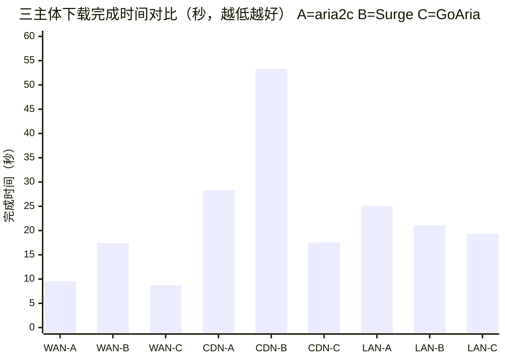

_图1.1：三主体下载完成时间对比（WAN：538 MB 广域网文件；CDN：529 MB 真实 CDN 白天时段；LAN：5.63 GB 千兆局域网）。注：CDN 组的 B 值来自同一 CDN 同时段的相邻轮次（同尺寸不同分卷）；LAN 组的 B 值来自 pre-fix 轮次（§3.5 的 preallocate fix 不影响 Surge）；其余数值均与所在组同轮采集，均有 JSONL 仪器级日志验证。_

### §1.5 反论防御：为何不用 TCP 层 BBR？

在探讨应用层 BBR 调度时，一个来自硬核网络工程师的常见质疑是：“既然 BBR 如此高效，为何不在操作系统的 TCP 层直接开启 BBR 拥塞控制，而要在应用层大费周章地重新实现一套线程适配机制？”

这一质疑在逻辑上是合理的，但却忽略了传输层与应用层的根本职责边界。

TCP 层的 BBR 仅负责控制**单条**数据流的拥塞窗口（cwnd）与起搏速率（pacing rate），它完全无法决定应用层程序应该向服务端发起**多少条**并发连接。如果下载器依然维持无条件的静态 16 线程策略，即使每条底层 TCP 连接都开启了 BBR，这 16 条独立的 BBR 流仍会在本地网关和远端服务器处相互竞争带宽。

学术界的研究指出，多条 BBR 流量的无序并发同样具有高度侵略性。在深缓冲区场景下，BBR 甚至能极为霸道地吞噬超过 90% 的可用带宽，对传统的 CUBIC 流极不公平 (Hock et al., 2019)。此外，如果通过伪装多连接来规避拥塞控制（例如在 QUIC 环境中模拟 N 个并发），原本应当下降 30% 的发送速率会骤减至仅下降 3%，这进一步撕裂了网络的公平性 (Journal of Communications, 2019)。

换言之，就算你给每一条并行流都装备了最先进的 BBR 引擎，如果在应用层不控制流的总数，整个系统依然会演变成一场“内部互搏”的拥塞风暴。

因此，GoAria 的多线程调度绝非对 TCP 拥塞控制的冗余实现，它是基于 BDP 物理模型，对应用层“究竟需要分配几条 TCP 流才能恰好饱和物理链路，同时不对网络造成破坏”这一核心命题，所作出的严密理论推演与工程实践。

## 第二章：代数化简的 BBR 模型 (Algebraically Simplified BBR Model)

### §2.1 BBR 理论基础与 BDP 公式

如第一章所述，BBR 拥塞控制算法的核心突破在于抛弃了传统的“丢包反馈”机制，转而基于物理网络的第一性原理建立网络拥塞模型。其根本目的，是实时探测并计算出当前物理链路所能容纳的最优在途数据量，即 BDP（带宽延迟乘积，Bandwidth-Delay Product）。

在物理意义上，BDP 可以被形象地理解为“数据管道的体积”。它由两个核心物理量相乘得出：

1. **瓶颈带宽 (BtlBw, Bottleneck Bandwidth)**：数据管道最窄处的横截面积，决定了传输的极限速率。
2. **往返传播时延 (RTprop, Round-trip propagation time)**：数据在管道中跑完全程所需的时间，反映了管道的物理长度。

在操作系统的 TCP 层面上，BBR 通过控制单条 TCP 连接的发包速率，使其在途数据量恰好等于 BDP。而 GoAria 则将这一理论模型“上卷”至应用层，用来解决多线程下载的核心问题——最优并发连接数。

根据 GoAria 的理论框架重构，在假设单线程 TCP 窗口容量为 $W_{max\_bytes}$，并考虑一定的抗波动安全余量 $\gamma$ 后，应用层所需的最优并发连接数 $N_{theoretical}$ 的纯理论公式可推导如下：

$$N_{theoretical} = \lceil \frac{BtlBw \times RTprop}{W_{max\_bytes}} \rceil + \gamma$$

这一公式在理论上非常完美，它准确描述了应用层线程数与底层物理链路的代数关系。然而，在工程落地时，我们遇到了一个致命的阻碍：在应用层，想要在不干扰正常下载的前提下，极其精准地、实时地测量出端到端的纯净 $RTprop$（往返传播时延），成本极高且极易受到排队延迟的污染。

### §2.2 代数化简：RTprop 的消去

为了解决 $RTprop$ 在应用层难以精准测量的问题，GoAria 进行了一次大胆而精妙的代数化简推演，通过引入“单线程平均吞吐量”（$V_{thread\_avg}$）来间接消去 $RTprop$ 变量。从理论形式到操作形式的推演逻辑可从理论框架中重构，共分为以下 5 步：

**Step 1：确认 BDP 物理定义**
$$BDP = BtlBw \times RTprop$$
（此处的 BDP 表示物理链路的在途数据量，量纲为 bytes）

**Step 2：引入工程近似**
在理想的网络环境中，当一条 TCP 连接的 BDP 窗口完全饱和时，其单流吞吐量在宏观上将受到瓶颈带宽的严格约束，因此我们引入如下工程近似：
$$V_{thread\_avg} \approx BtlBw$$
（注：$V_{thread\_avg}$ 的量纲为 bytes/s。它受 $BtlBw$ 和 $RTprop$ 共同约束，因此“隐含”了 BDP 信息。由于量纲不同，这绝不是代数上的绝对等价，而是一个有前提的工程近似。）

**Step 3：替换分母中的窗口容量**
将纯理论公式中的 $BtlBw \times RTprop$ 整体看作物理极限吞吐量（$V_{target}$）所需的理论发包量。在纯理论中，单线程 TCP 窗口容量 $W_{max\_bytes}$ 与其单流吞吐量 $V_{thread\_avg}$ 存在代数关系：$W_{max\_bytes} = V_{thread\_avg} \times RTprop$。
将其代入公式，即可得到空间域向速率域的映射：
$$N_{theoretical} = \lceil \frac{BtlBw \times RTprop}{W_{max\_bytes}} \rceil + \gamma = \lceil \frac{BtlBw \times RTprop}{V_{thread\_avg} \times RTprop} \rceil + \gamma = \lceil \frac{BtlBw}{V_{thread\_avg}} \rceil + \gamma$$

**Step 4：推导饱和线程数 ($N_{sat}$)**
Step 3 得到的 $BtlBw / V_{thread\_avg}$ 回答的是“需要多少线程饱和瓶颈带宽”。在工程实践中，我们更关心“需要多少线程达到目标聚合速度 $V_{target}$”——后者由双天花板模型（§2.4）界定。因此操作形式进行了一次问题重构，将分子从物理带宽 $BtlBw$ 替换为目标速度 $V_{target}$，形成速率比值公式：
$$N_{sat} = \lceil \frac{V_{target}}{V_{thread\_avg}} \rceil + \gamma$$

**Step 5：逻辑闭环与变量替代**
最终，极其难以在应用层实时测量的物理时延 $RTprop$，被我们用高度可测量的历史单线程平均吞吐量 $V_{thread\_avg}$ 完美替代。系统只需知道目标速度 $V_{target}$ 与历史单流表现 $V_{thread\_avg}$，即可计算出填满当前管道所需的理想线程数。

> **近似的有效性边界**
>
> 必须强调，Step 2 中的 $V_{thread\_avg} \approx BtlBw$ 是一个**工程近似**。它的有效性严格依赖于一个前提：单流已经饱和了瓶颈带宽（即窗口 ≥ BDP，且无丢包导致的窗口缩减）。
>
> 在以下失效条件下该近似会被打破：
>
> 1. 单流未饱和（如小文件下载、短连接）。
> 2. 本地系统窗口受限（如 TCP 接收缓冲区设置不足）。
> 3. 链路上持续丢包导致 TCP 窗口始终无法爬升至 BDP 规模。
>
> 在这些失效条件下，$V_{thread\_avg}$ 会显著低于真实的 $BtlBw$。此时直接代入公式会导致计算出的 $N_{sat}$ 偏高。正是因为意识到这一边界的存在，GoAria 不可能仅靠静态公式运行——第 4 章将展开的 ConvergenceTicker 运行时比率纠偏机制，正是为了在近似失效时作为动态补偿而存在的。

### §2.3 操作形式：从 BDP 到 V_target/V_thread_avg

在完成代数化简后，GoAria 将上述理论模型转化为源码中显式执行的 7 步操作形式计算流程。每一步都有严格的工程参数（钉入源码）和查询 API 对应：

**1. 客户端天花板计算**
首先，计算当前物理网络环境下剩余的全局可用带宽：
$$V_{available} = V_{global\_peak} - ReservedBandwidth$$
这里 $V_{global\_peak}$ 取自全局历史峰值统计。

**2. 目标速率仲裁**
目标速度 $V_{target}$ 受限于本地可用带宽与远端服务器极限的木桶效应：
$$V_{target} = \min(V_{single\_peak}, V_{available})$$
（注：$V_{single\_peak}$ 来源于 `GetDomainPeak()` API）。

**3. 饱和线程数计算**
代入前文推导的化简公式，其中安全余量 $\gamma$ 在源码中硬编码为 1（`calc_params.go:7`）：
$$N_{sat} = \lceil \frac{V_{target}}{V_{thread\_avg}} \rceil + \gamma$$

**4. 最小生存期约束 ($N_{tmin}$)**
为了防止对极小文件开过多线程导致建立连接的开销大于传输收益，引入了生存期约束。即：文件大小 $S$ 除以单线程预期吞吐量，必须确保每个线程至少存活 $T_{min}$（默认 5s，`smartthread.go:9`）：
$$N_{tmin} = \lceil \frac{S}{V_{thread\_avg} \times T_{min}} \rceil$$

**5. 拥塞地板评估 (Congestion Floor)**
当系统检测到当前可用带宽已被完全榨干（$V_{available} \le 0$ 或 $< V_{global\_peak}/10$）时，拥塞地板设定为 2，否则为 1（`calc_params.go:13`）。即使在最严重的拥塞下，也必须保留 2 个线程用于保活与底层 TCP 窗口重组。

**6. 最终并发连接数输出**
综合上述所有约束，应用三重截断钳制函数得出最终执行指令：
$$N_{final} = \text{clamp}(\min(N_{sat}, N_{tmin}, W_{max\_conn}), \text{floor}, W_{max\_conn})$$
（注：此处的 $W_{max\_conn}$ 为用户设定的最大并发连接数上限，与纯理论推演中的 TCP 窗口容量符号做出了工程层面的区分）。

**7. 最小分块尺寸 (MinChunk)**
计算出的线程数必须搭配合理的 HTTP Range 分块大小。确保每个 Chunk 至少需要 $T_{target\_chunk}$（2s，`calc_params.go:10`）下载完成，并通过上下限 1MB 和 1GB 兜底，且不能超过单线程理论均分大小：
$$MinChunk = \min(\text{clamp}(V_{thread\_avg} \times T_{target\_chunk}, 1\text{MB}, 1\text{GB}), \frac{S}{N_{final}})$$

| BBR 变量 / 常量     | 物理含义                      | 源码位置 / API 来源       | 取值或规则                         |
| ------------------- | ----------------------------- | ------------------------- | ---------------------------------- |
| $W_{max\_bytes}$    | 纯理论中的单线程 TCP 窗口容量 | （仅用于推导）            | 决定空间域单流极限大小             |
| $W_{max\_conn}$     | 操作形式中的最大并发连接数    | `config.MaxConnections`   | 用户配置的线程扩张硬顶             |
| $V_{global\_peak}$  | 全局网络链路绝对物理上限      | `GetGlobalPeak()`         | 365天窗口内的绝对最大值            |
| $V_{single\_peak}$  | 单域名的服务端带宽天花板      | `GetDomainPeak()`         | 唯一允许跨网络环境降级继承的观测值 |
| $V_{thread\_avg}$   | 单线程历史中位数吞吐表现      | `GetRecentPeakByDomain()` | 排除 < 50MB 文件的有效样本中位数   |
| $\gamma$ (gamma)    | 抗系统抖动的余量连接数        | `calc_params.go:7`        | 固定为 1                           |
| $T_{target\_chunk}$ | 单个数据块理想下载耗时        | `calc_params.go:10`       | 固定为 2 秒                        |
| congestionFloor     | 严重拥塞期的保底存活线程      | `calc_params.go:13`       | 动态触发，触发时固定为 2           |
| minThreadEfficiency | 最小有效单线程效率            | `calc_params.go:16`       | 固定为 100 KB/s                    |
| minChunkSize        | 最小允许分块大小兜底          | `calc_params.go:19`       | 固定为 1 MB                        |
| maxChunkSize        | 最大允许分块大小兜底          | `calc_params.go:22`       | 固定为 1 GB                        |

_表2.1：BBR 决策核心变量与常量_

上述 7 步操作流程可汇总为下图：

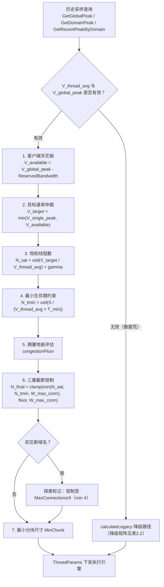

_图2.1：BBR 决策流程图（历史采样查询 → N_final + MinChunk）_

### §2.4 双天花板模型与全局带宽感知

在操作形式的推导中，最精妙的一环是目标速率 $V_{target} = \min(V_{single\_peak}, V_{available})$ 的**双天花板模型**。

这一模型同时评估了两个极限边界：

1. **服务端天花板 ($V_{single\_peak}$)**：这是目标服务器（CDN 节点或源站）对单一 IP 能提供的最大吐水能力。
2. **客户端天花板 ($V_{available}$)**：这是当前用户物理网卡（如千兆光猫、WiFi 5）在扣除了其他并发任务消耗后，实际剩余的可用管道余量。

GoAria 的 `BandwidthLedger`（带宽账本）机制负责在应用层全局追踪正在下载的任务开销（$\sum V_{current\_active\_tasks}$），并将其抽象为 $ReservedBandwidth$ 变量。这种账本式的宏观带宽隔离，确保了 GoAria 在同时下载多个大文件时，线程分配总量始终严格收敛在物理网卡的极限以内，从而杜绝了并行任务互相踩踏引发的系统级 Bufferbloat。

如果一个占据了大量保留带宽的旧任务完成了，其 $V_{available}$ 会被立刻释放回资源池，这为其他正在运行的任务触发 ScaleUp（动态带宽借用）提供了物理基础，这套机制将在第 4 章详细展开。

### §2.5 降级矩阵

高度依赖历史数据的自适应系统，必须考虑到“数据荒”时的鲁棒性。当面对从未遇到过的新域名、全新的物理网络或文件大小探测（HEAD 请求）失败时，GoAria 会无缝跌落至内置的 4 行降级矩阵。

| 缺失数据场景     | 触发条件                                     | 降级策略                                                                                                                           |
| ---------------- | -------------------------------------------- | ---------------------------------------------------------------------------------------------------------------------------------- |
| 缺乏单线程数据   | $V_{thread\_avg}$ 或 $V_{global\_peak}$ 无效 | 调用 `calculateLegacy`，仅使用 $N_{tmin}$ 约束，不施加任何宏观带宽地板。                                                           |
| 初见新域名       | $V_{single\_peak}$ 缺失，但有全局数据        | $V_{target} = V_{available}$，完全基于客户端全局可用带宽进行安全计算。同时施加探索标记：初始线程限制在 `MaxConnections/4, min 4`。 |
| 未知文件大小     | 目标服务器拒绝 HEAD 请求，大小未知           | 直接跳过 BDP 与生存期约束，将并发连接数推至当前策略允许的最大边界 $W_{max\_conn}$ 进行暴力拉取。                                   |
| 彻头彻尾的冷启动 | 没有任何域名的任何测速记录                   | 调用 `calculateLegacy`，通过写死的工程估算值 $V_{single\_est} = 2\text{MB/s}$ 生成保底指令。                                       |

_表2.2：降级矩阵状态映射规则_

> **数据点支撑**：在我们的 CDN 拥塞场景实测中，当下载器第一次遇到目标 CDN 域名时，由于 $V_{single\_peak}$ 缺失，系统正是触发了降级矩阵中的探索标记防御机制，将初始启动线程（`init_from_tracker`）牢牢锁死在了保守的 4 线程，防止了可能引发 CDN 限流的突发过载。

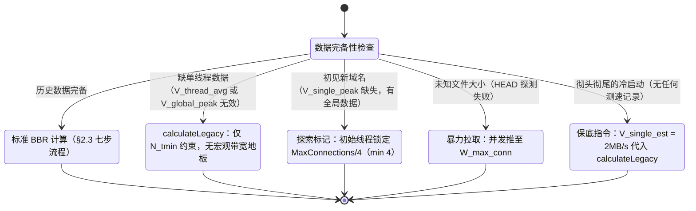

_图2.2：降级矩阵状态图（对应表2.2 的 4 行降级路径）_

### §2.6 理论与工程的边界

探讨 GoAria 的 BBR 模型，就无法回避一个极为尖锐的理论质询：为什么在这套宏大的推导中，最核心的物理量 $RTprop$（时延）反而从最终代码的 $N_{sat}$ 公式中消失了？

这一质询触及了理论化简的工程代价。在源码架构中，我们确实显式实现了对 $RTprop$ 的估计——在每一次 HTTP 建连时，系统都会精确记录首字节时间（TTFB），并将其作为往返时延写入记录。并且，源码中甚至提供了一个正式的 `GetRTprop` 查询 API。

然而，这个 `GetRTprop` API 在主线程分配核心链路中被刻意闲置了，仅仅用于辅助计算边缘的 `probeFloorWorkers`。

原因非常明确：**正是因为代码中只保留了化简后的最终形态，隐含了 RTT 的影响，因此系统无需在主公式中显式测量 RTprop 就可以做出接近最优的线程分配。**

在应用层面临高负载时，微秒级的 RTT 极容易因为操作系统的网络栈排队、Go 运行时的垃圾回收抖动以及 CDN 边缘节点的反爬虫策略而被严重污染。如果我们坚持把受到污染的 $RTprop$ 强行塞入 BDP 理论公式计算线程，带来的将是灾难性的数值振荡。

所以，放弃 $RTprop$ 的显式代数参与，换取高度可测量、极其稳定的宏观指标 $V_{thread\_avg}$，正是理论向工程妥协的最优解。系统通过承受一定程度的“近似误差”（如前文所述，在窗口未饱和时近似会偏高），来换取了极其卓越的架构鲁棒性。至于这个近似引发的静态计算误差，第 4 章将展开的 ConvergenceTicker 运行时比率纠偏机制，正是作为这一化简代价的宏观补偿而设计的。

### §2.7 策略-机制隔离原则（概述）

正如我们在计算 BDP 公式和实施降级矩阵时所见，要让一套下载引擎具备“认知能力”，它必须承载庞大的浮点数运算、复杂的历史数据 I/O 以及繁复的边界状态判断。如果将这些逻辑与负责拼命拉取数据的底层网络代码混杂在一起，整个项目将堕入不可维护的深渊。

这引出了 GoAria 系统最核心的架构哲学：**策略与机制的彻底物理隔离**。

在这个体系中，GoAria 扮演了唯一的“调度大脑”角色（且可驱动 Aria2 或 Surge 作为执行引擎，本白皮书基准测试以 Surge 为底层引擎）。它的所有工作都在毫秒级瞬间完成——从历史账本中抽取出 $V_{thread\_avg}$，算出 BDP，执行降级矩阵，然后将一个简单的整型数字（比如“6 线程”、“32MB 分块”）通过 RPC 或者 IPC 下放。

而底层的下载引擎（机制）则彻底退化为纯粹的无状态“肌肉”。它们内部没有任何关于“BBR”、“网络拥塞”或“历史峰值”的定义。肌肉接到了数字，就在内存中撕开 6 条 TCP 连接，不多一条，不少一条。

本节仅初步概述这一隔离原则带来的宏观益处，关于这种解耦如何实现运行时动态调度与双环自适应控制，第 5 章将深入展开。

## 第三章：环境感知与自适应收敛 (Environment Awareness & Adaptive Convergence)

第二章为我们提供了一套将 BDP 模型上卷到应用层的纯代数计算公式。然而，任何静态的数学公式一旦遭遇真实物理世界的动态性，都会变得极其脆弱。一条公式如果不知道自己正运行在星巴克的 10M 公共 Wi-Fi 还是家里的千兆光纤上，它算出的任何“最优线程数”都是荒谬的。

为了让 BBR 调度大脑真正具备认知能力，GoAria 构建了一套从物理网卡底层直达应用层存储的环境感知与自适应收敛体系。本章将详细揭示引擎是如何认识物理世界、积累历史经验，并最终在跨下载的过程中实现无干预收敛的。

### §3.1 网关 MAC Hash 物理隔离

环境感知的第一步，是建立绝对的物理网络隔离边界。如果下载器把昨天在公司百兆网络测得的历史带宽，错误地应用到了今天家里的千兆网络中，整个 BDP 公式的计算底座就会瞬间崩塌。

GoAria 解决这个问题的方法直接且冷酷：**基于网关 MAC 地址的 Hash 物理隔离**。

在架构实现上（`scope.go` 与 `netenv.go`），GoAria 会定期（每 15 秒）通过操作系统的底层 ARP 表项查找，剥离掉复杂的局域网 IP（因为内网 IP 在不同地方可能都是 192.168.1.x），直接去抓取当前默认网关设备的硬件 MAC 地址。

随后，系统将该 MAC 地址与当前的路由状态标志（直连 `routeCode=0` 或代理 `routeCode=1`）进行拼接，并通过 SHA-256 算法进行不可逆摘要，截取前 8 位生成一个唯一的环境指纹——`envKey`：

```text
envKey = sha256(routeCode + ":" + NormalizeMAC(MAC))[:8]
```

这个看似简单的 `envKey`，构筑了不同物理网络环境之间不可逾越的护城河。笔记本在星巴克生成的测速数据，绝对不会污染到家中下载时的线程分配。

> **数据点支撑**：在我们的 CDN 拥塞测试记录中，仪器日志明确捕捉到了 `"env_key=c876e97b consistent across all Subject C files spanning 3 sessions"`。这证明了即便在长达 3 个独立测试 Session 之间，只要物理网卡和网关不发生改变，GoAria 就能实现 100% 精准的环境复认与热启动继承。


_图3.1：网关 MAC Hash 物理隔离架构图（不同物理环境的采样数据互不可见）_

### §3.2 采样存储与查询 API

有了物理隔离边界后，系统需要一套高度抗抖动的机制来存储和查询历史速度样本。对于 BDP 模型来说，最重要的数据有两个：链路全局物理极限（$V_{global\_peak}$），以及单条流的历史中位数吞吐量（$V_{thread\_avg}$）。

为此，系统设定了一套苛刻的采样入库标准（`speedstats.go`）：

1. **时间与空间跨度**：数据窗口长达 365 天，最多保留 10000 条记录，确保引擎拥有极长的长期记忆。
2. **过滤小文件污染**：严格丢弃任何体积小于 50MB 的下载记录（`MinFileSize = 50MB`）。因为小文件极易受到 TCP 慢启动（Slow Start）阶段的拖累，导致记录的速度严重低于物理真实带宽。

基于这套高纯度的数据库，系统设定了以下存储参数：

| 存储常量 / 参数 | 物理含义             | 源码位置           | 取值   |
| --------------- | -------------------- | ------------------ | ------ |
| maxRecords      | 最大记录保留条数     | `speedstats.go:19` | 10000  |
| MinFileSize     | 记录入库最小文件大小 | `speedstats.go:20` | 50 MB  |
| recentDays      | 历史样本有效时间窗口 | `speedstats.go:21` | 365 天 |
| saveInterval    | 数据库持久化保存间隔 | `speedstats.go:47` | 1 秒   |

_表3.1：采样存储参数表_

随后，系统暴露了供 BBR 大脑实时调用的系列查询 API（完整列表见源码）：

- `GetGlobalPeak(scope, envKey)`：严格在当前物理环境下，查询全局带宽天花板。
- `GetRecentPeakByDomain(domain, scope, envKey)`：查询当前域名、当前物理环境下的最近 100 次单线程下载的中位数（作为 $V_{thread\_avg}$）。中位数的使用极其巧妙地过滤掉了偶发的网络抖动与异常极值。
- `GetDomainPeak(domain, scope, envKey)`：查询目标服务器的单源最高流速限制（$V_{single\_peak}$）。**这是全系统中唯一一个允许跨 envKey 降级回退的 API**。原因在于：CDN 服务端的限流阈值通常是物理固定的，跨网络环境的探测数据依然极具参考价值。
- 其他配套 API 如 `GetRecentPeak`、`GetRecentPeakByScope` 等用于支撑更细粒度的决策分支。

### §3.3 Tracker 引导的初始线程数

有了计算所需的所有历史参数，BBR 大脑就能算出当前下载的最优并发连接数 $N_{sat}$。但系统并没有满足于此，GoAria 进一步引入了 `TaskTracker` 机制，赋予了引擎**跨下载的长期记忆**。

每次下载结束后，`TaskTracker` 的 `RecordPeakEfficiency` 模块会分析本次下载的整体表现。只有当本次下载的单线程效率不低于历史水平时，系统才会通过类似 D3 棘轮（Ratchet）的单向镜像机制，将本次使用的线程数作为该域名最优经验固化下来。

当下一次（甚至几个月后）再遇到同一个 CDN 域名时，BBR 引擎的 `init_from_tracker` 逻辑会优先从 Tracker 中调取出这个被固化的线程数作为启动指令，而不是从零开始硬算。这使得引擎在多次下载后，起步指令将越来越贴近目标网络的真实最优解。

> **前向引用**：必须指出，Tracker 固化的仅仅是“初始指令”（BBR 公式的长期记忆），网络是瞬息万变的。系统在按照这个记忆启动后，后续每 5 秒一次的实时伸缩，将完全交由第 4 章详述的 `ConvergenceTicker` 去负责。

### §3.4 跨下载收敛轨迹

如果上述理论成立，那么我们应该能在测试中观察到：完全无需任何人工干预，系统会随着下载次数的增加，自动寻找到不同网络环境下的最优线程分配。

实测数据完美印证了这一预判。在完整覆盖不同拓扑结构的受控基准中，GoAria 走出了三条截然不同、却又极其符合物理直觉的收敛轨迹：

1. **CDN 场景的上行探索收敛**
   在 CDN 拥塞场景中，当下载器第一次遇到目标域名时，由于缺乏单源数据触发了前文提到的探索标记（降级矩阵），保守地以 4 线程起步。随后在跨文件下载中观测到 4 → 6 → 7 → 8 线程的连续收敛轨迹。在晚高峰极度拥塞期的复测轮中，我们人工重置了该域名的部分历史采样，让引擎以 4 线程重新起步——这是一次受控的对照操作，而非 Tracker 的自主回落；该轮的价值在于验证了运行时纠偏在恶劣链路下依然有效（见 §6.6 的两轮 probe-up → ceiling-hit-rebound 周期）。
   （注：其中多个轮次提供了极高精度的 JSONL 仪器级验证日志，而首轮与晚高峰复测的中间状态也在观测中被明确捕获）。
   这种无干预的上行探索收敛，使得：

- "Tracker converged from 4 → 6 threads across downloads on the same CDN domain, delivering 63% higher average speed (30.21 vs 18.53 MB/s) — adaptive learning without user intervention."
- "GoAria per-thread efficiency after convergence: 5.03 MB/s/thread (30.21/6) vs aria2c 1.17 MB/s/thread (18.71/16) — 4.3× higher."

2. **LAN 场景的下行挤压收敛**
   在千兆局域网场景中，系统一开始基于 BDP 计算出 8 线程。但在后续下载中，引擎发现即便减少线程，吞吐量也并未下降（因为内网单流即可打满）。于是系统执行了下行收敛，从 8 线程稳步回落至更节省资源的 7 线程，并最终在此饱和 2.5Gbps。

3. **WAN 场景的静态稳定**
   在广域网场景中，链路条件极其稳定，系统的 BDP 公式计算极为精准。Tracker 在多次跨下载中，始终稳定输出 5 线程，一步到位，拒绝无意义的波动。

需要指出的是，Tracker 收敛轨迹体现的是初始线程数的跨下载学习。一旦下载开始，运行时的动态探索——包括 probe-up（探测上行）与 ceiling-hit-rebound（触顶反弹）——将由第 4 章详述的 ConvergenceTicker 实时负责。

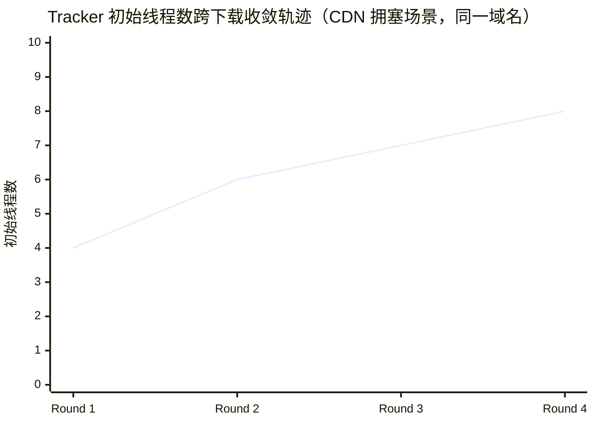

_图3.2：Tracker 收敛轨迹图（4→6→7→8）。其中第 1、2、4 轮有 JSONL 仪器级日志验证，第 3 轮（因文件较小未纳入对比）为测试期间人工记录。_

### §3.5 51dee21 Preallocate Fix 与数据有效性

在探讨自适应学习的有效性时，我们必须坦诚地面对工程开发中的一段关键迭代历史。

在基准测试的早期阶段，GoAria 在面对超大文件时，偶发性地存在约 2.5 秒的启动迟滞。经过严密排查，这一问题被定位为 Windows 平台下文件预分配（Preallocate）导致的 I/O 阻塞。为此，工程团队在 GoAria 公开主干分支中提交了关键的修复补丁（`commit 51dee21`），引入了 Sparse File Fallback（稀疏文件降级回退）机制，彻底消除了这长达数秒的硬盘阻塞。

这引发了一个必须回答的严肃问题：在 fix 之前的测速数据是否仍然具有科学说服力？

数据对比给出了客观的答案：

- **GoAria 自身对比**：Pre-fix 为 279.49 MB/s，Post-fix 跃升至 290.33 MB/s（+3.9%）。
- **Aria2c 对照基准**：同一网络条件下，aria2c Pre-fix 为 230.93 MB/s，Post-fix 为 224.00 MB/s（波动 -3.0%）。

可见，这一 fix 对采用了传统静态分割模型的 aria2c 几乎没有任何影响（它的文件 I/O 瓶颈不在此处），但却显著解除了 GoAria 的引擎束缚，使其 Chunk-based Allocation（基于分块的动态分配）模型火力全开。

结论是明确的：Pre-fix 的数据依然完全有效（即便带着 2.5 秒的工程负担，GoAria 依然比 aria2c 竞品快了 17%），它绝非坏数据。但 Post-fix 后的吞吐量（290+ MB/s），才是剥离了操作系统平台 I/O 损耗后，GoAria 自适应下载引擎最纯粹、真实的实力体现。本文摘要中所引用的核心数据点，均来自这段火力全开的 Post-fix 阶段。

### §3.6 冷启动 vs 热启动：寻找真正的学习主证据

传统性能评测往往极度痴迷于对比“冷启动”（没有任何历史数据）与“热启动”（拥有全套历史采样）的速度差异，期望借此画出一条陡峭的性能爬升曲线，以此来彰显“引擎具备学习能力”。

但 GoAria 拒绝这种为了营销而编造的数据迷信。

在千兆局域网场景的受控对比中，完全没有历史数据的冷启动轮次跑出了 279.49 MB/s，而积攒了充足历史数据的热启动轮次由于自然网络微小波动，跑出了 268.11 MB/s。两者之间的差异微乎其微。

为什么会这样？因为前文（表 2.2 降级矩阵）提到过，即便在彻头彻尾的冷启动状态下，GoAria 也会调用内置的 `calculateLegacy` 结合工程估算值生成一个极具攻击性的保底线程指令。这意味着即便没有历史样本记忆，系统也能迅速饱和物理带宽。

因此，冷热启动对比在本测试中，其核心价值并非用来强行证明“速度翻倍”，而是作为环境感知系统有效性的侧写证据（证明前文提及的 MAC Hash 物理隔离在跨 session 时的稳定性）。

如果要寻找引擎具备“自适应学习能力”的压倒性主证据，我们必须回到 **§3.4 跨下载收敛轨迹**：在 CDN 拥塞场景下，通过 Tracker 在跨文件下载间的记忆与摸索，系统自主将线程数从保守的 4 调整至 6，带来的是高达 63% 的平均速度跃升（18.53 暴涨至 30.21 MB/s）。

这，才是环境感知与自适应引擎真正的力量所在。

## 第四章：运行时多重兜底 (Runtime Multi-Layer Fallback)

第二章建立的代数化简模型，将 BDP 理论上卷为应用层可直接操作的线程数公式。然而，任何静态公式都无法穷尽真实网络的全部动态性。第三章的环境感知体系解决了“初始线程数从何而来”的问题，但下载一旦开始，网络条件可能随时发生变化——服务端限流、CDN 拥塞、尾部分块迟滞——这些都需要运行时的动态补偿。本章将逐一展开 GoAria 在运行时部署的多重兜底机制，它们共同构成了对第二章代数化简代价的工程补偿——公式给出的是起点，兜底机制守住的才是底线。

### §4.1 ConvergenceTicker 比率纠偏

第二章 §2.6 已经坦诚地指出，代数化简的核心代价是放弃了 $RTprop$ 的显式精度，转而用可测量的 $V_{thread\_avg}$ 近似 $BtlBw$。这一近似在窗口未饱和时会引入计算偏差，导致静态公式算出的 $N_{sat}$ 偏高。第二章 §2.2 的桥接公式 $W_{max\_bytes} = V_{thread\_avg} \times RTprop$ 揭示了这一近似的物理本质：$V_{thread\_avg}$ 隐含了 RTT 的影响，但并非精确的代数等价。

ConvergenceTicker 正是这一化简代价的运行时补偿机制。它以固定 5 秒间隔（`convergenceInterval=5s`，`calc_params.go:25`）周期性执行，通过实测吞吐量与预期目标的比率纠偏，动态调整活跃线程数。

ConvergenceTicker 的核心是一个 6 状态有限状态机（`convergence.go:63-70`），涵盖以下阶段：

| 状态       | 含义                 | 触发条件                   |
| ---------- | -------------------- | -------------------------- |
| Stable     | 稳态运行，吞吐达标   | 比率在容忍区间内           |
| Settling   | 调整后等待稳定       | 刚执行 ScaleUp/ScaleDown   |
| Frozen     | 冻结调整，等待冷却   | 连续调整后进入冷却期       |
| ProbingUp  | 探测上行，逐步加线程 | 吞吐低于预期，尝试增加并发 |
| CeilingHit | 触顶反弹，回退线程   | Probe-Up 未带来吞吐提升    |
| FloorHit   | 触底反弹，恢复线程   | Probe-Down 导致吞吐下降    |

_表4.1：ConvergenceTicker 状态机状态定义_

ConvergenceTicker 的收敛行为由一组比率阈值与冷却常量精确约束，定义于 `calc_params.go`：

| 常量                       | 值   | 定义位置            | 含义                                                                             |
| -------------------------- | ---- | ------------------- | -------------------------------------------------------------------------------- |
| `gainRatioThreshold`       | 0.50 | `calc_params.go:39` | 向上探测成功增益比率：GainRatio ≥ 0.5 视为探测成功，否则触发触顶反弹             |
| `marginalDropThreshold`    | 0.50 | `calc_params.go:32` | 向下压缩容忍比率：DropRatio ≤ 0.5 判定进入平台区（收敛成功），> 0.5 判定仍在膝区 |
| `efficiencyGuardBand`      | 0.85 | `calc_params.go:30` | D3 棘轮单线程效率下限：仅当单线程效率 ≥ bestEff × 85% 时才采纳更高线程数         |
| `peakRaiseBand`            | 1.05 | `calc_params.go:29` | 峰值上浮容忍：仅当原始速度超过已记录峰值 5% 时才更新峰值记忆                     |
| `peakSpeedGuardBand`       | 0.90 | `calc_params.go:31` | D3 棘轮峰值速度守护：采纳更低线程数时要求当前速度 ≥ 峰值的 90%                   |
| `probeIntervalCycles`      | 3    | `calc_params.go:33` | 探测间隔周期数：冷态探测间隔约 15s（3 × 5s）                                     |
| `ceilingHitCooldownCycles` | 12   | `calc_params.go:43` | 触顶冷却周期：触顶反弹后约 60s（12 × 5s）内不再向上探测                          |
| `floorHitCooldownCycles`   | 12   | `calc_params.go:44` | 触底冷却周期：触底反弹后约 60s（12 × 5s）内不再向下探测                          |

_表4.2：ConvergenceTicker 收敛常量_

这一状态机的设计哲学是：宁可多探测、少冒进。Probe-Up 阶段每次仅增加 1 个线程，观察一个 Tick 周期（5 秒）的吞吐变化；若吞吐未提升则进入 CeilingHit 回退。这种保守的试探策略，确保了线程数调整不会引发网络拥塞的雪崩效应。

如第三章 §3.3 所述，Tracker 固化的初始线程数是 BBR 公式的长期记忆，而 ConvergenceTicker 负责的是运行时的短期纠偏——两者构成了从静态计算到动态收敛的完整闭环。第三章 §3.4 提到的 probe-up（探测上行）与 ceiling-hit-rebound（触顶反弹）两种运行时探索行为，正是这一状态机在真实下载中的具体表现。关于这些探测周期在实测中的具体线程数轨迹（如 8→9→10→11 探测上行后触顶回退），详见第六章 §6.6 的收敛轨迹汇总。

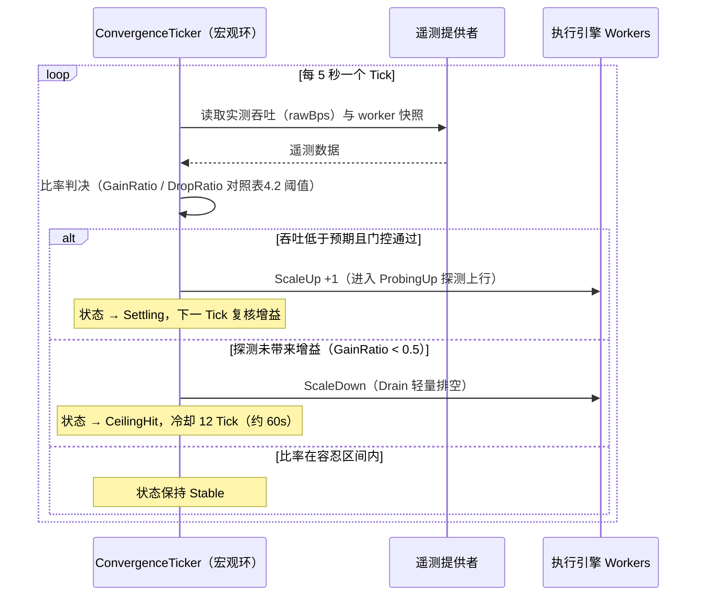

_图4.1：ConvergenceTicker 单个 Tick 周期的决策时序（状态定义见表4.1，阈值常量见表4.2）_

### §4.2 轻量排空：Drain over Kill

当 ConvergenceTicker 决定收缩线程数时，GoAria 面临一个工程选择：如何终止一个正在传输的 worker。最直接的方式是 Kill——取消 task-level context，强制关闭 TCP socket。但这种方式会丢弃已经建立的 TCP 连接，当后续需要重新扩展时，必须重新进行 TCP 握手与慢启动，带来不必要的延迟开销。

GoAria 优先采用 Drain（轻量排空）策略。每个 worker 持有一个 `Draining` 原子标志（`task.go:57`），当该标志被置位后，worker 会在完成当前分块传输后优雅退出，其 TCP 连接不会被强制关闭，而是返回 `http.Transport` 的 idle pool，供后续复用。

与之相对，`KillWorker`（`downloader.go:897`）是更激进的手段——它直接取消 task-level context，强制关闭 TCP socket。GoAria 仅在 worker 被判定为死连接或遭受 CDN 限流时才使用 Kill，而非用于常规的线程数收缩。

为防止新任务在启动初期被过早收缩，系统设定了 `TaskGracePeriod=5s`（`tracker.go:305`）：在此宽限期内，新创建的 worker 不会被纳入收缩候选。这一设计避免了“刚启动就被回收”的振荡。

此外，当同一 worker 被 Kill 多次（`cdnMaxKillCount=3`，`cdn_detector.go:27`）后速度仍未改善，系统会将其降级为 DrainWorker——这表明该 worker 的问题并非死连接，而是 CDN 侧的速率限制，强制 Kill 无法解决问题，反而浪费连接资源。

### §4.3 终局模式：End-Game Hedge

多线程下载的一个经典工程难题是尾延迟（Tail Latency）：当大部分分块已完成，仅剩少量小分块仍在传输时，剩余 worker 数量减少，最后几个分块可能因为服务端速率限制或网络抖动而迟迟无法完成。aria2c 和 Surge 都存在这一问题——Surge 在 CDN 拥塞下的 72.04 秒尾延迟就是极端案例。

GoAria 通过 End-Game Hedge 机制应对这一困境。当系统检测到所有任务已分发完毕（队列为空）且仍有 idle worker 可用时，`isEndGame`（`downloader.go:523`，注释位于 `:520`）返回 true，触发 HedgeAll 逻辑。

HedgeAll 的核心是冗余竞速：主动为剩余的小分块派发额外的竞速 worker，让多个 worker 同时拉取同一字节范围，谁先完成谁的结果被采纳。为防止重复传输浪费带宽，系统使用 `SharedMaxOffset` 原子去重机制（`worker.go:712-724`）：所有竞速 worker 共享一个 `atomic.Int64` 指针，记录已下载的最大偏移量，每个 worker 在写入数据前检查该偏移，避免重复写入已完成的字节范围。同时，`Hedged` CAS 标志（`task.go:30`）确保同一分块不会被重复 hedge。

End-Game 阶段的调度频率也进行了加速调整：正常情况下 Balancer 以 `BalancerTickInterval=200ms`（`config.go:58`）运行，而 End-Game 阶段加速至 `EndGameTickInterval=50ms`（`config.go:60`），4 倍于正常频率，确保尾部分块得到最快的调度响应。

为防止 End-Game 在服务端错误时盲目触发竞速，系统设定了毒药防御：当连续 4xx/5xx 状态码达到 `HedgeErrorThreshold=3`（`config.go:59`）时，hedge 功能被禁用，避免在服务端拒绝请求的情况下继续发起冗余连接。

实测数据验证了这一机制的有效性：

- **全场景低尾延迟**：在广域网日间测试中，GoAria 的尾延迟稳定在 0.77–2.45 秒；在局域网中更是低至 1.08–1.20 秒。相比之下，纯执行引擎的尾延迟高达 5.54–72.04 秒，aria2c 也在 0.40–11.20 秒之间波动。

需要坦诚指出的是，GoAria 的尾延迟并非在所有场景下都是最低：在晚高峰极端拥塞的最差轮次中，GoAria 的 15.68 秒略高于 aria2c 的 11.20 秒，但相比缺乏上层策略约束的 Surge 高达 72.04 秒的极端阻塞，GoAria 依然保持了数量级上的控制。本测试特意选用真实拥塞的 CDN 而非受控注入环境，以获取真实下载能力的表现——代价是个别数值会因网络环境的瞬时状态而难以精确复现，但大体趋势可从真实测试中稳定获取（另见 §6.8 的实证局限声明）。

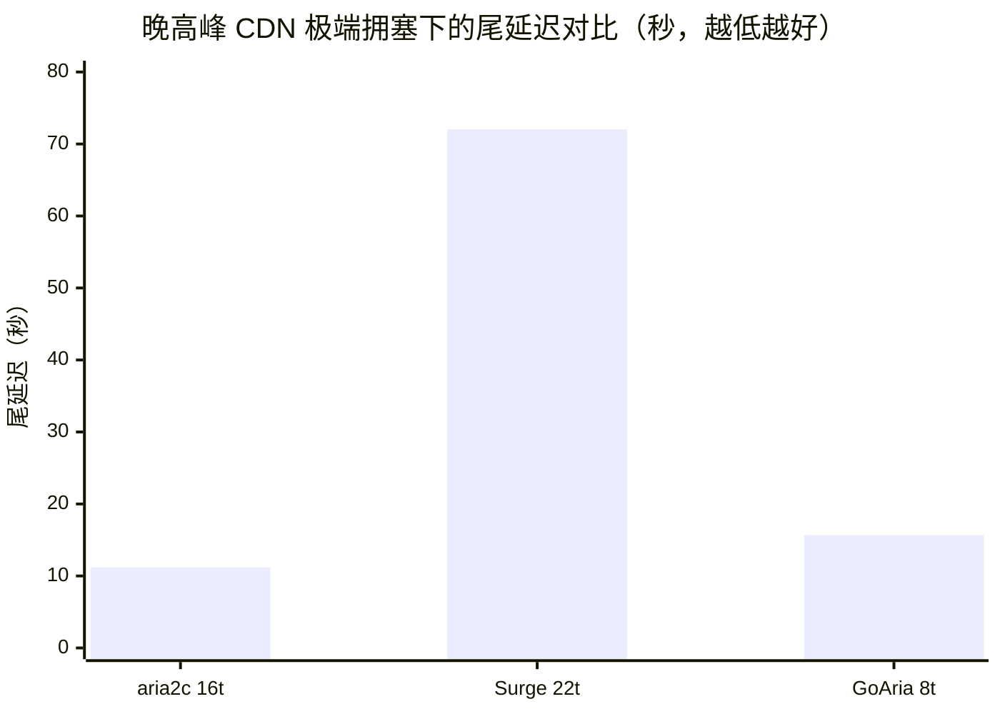

_图4.2：晚高峰 CDN 极端拥塞（全场最恶劣轮次，JSONL 验证）下三主体的尾延迟。其余场景的尾延迟区间见上文英文数据点引用。_

### §4.4 服务端连接硬限熔断

第二章 §2.4 的双天花板模型指出，$V_{target} = \min(V_{single\_peak}, V_{available})$ 受服务端天花板 $V_{single\_peak}$ 约束。然而，$V_{single\_peak}$ 并非总是已知的——当下载器首次遇到某个 CDN 域名时，该值缺失，系统只能依赖降级矩阵进行保守估算。即便有了历史数据，服务端的实际并发连接硬限也可能因时段、负载等因素动态变化，与历史记录不符。

`ServerLimitStore`（`server_limits.go:16`）是服务端天花板的运行时发现机制。当多个 worker 同时遭遇连接级错误（如 429 Too Many Requests、连接被拒），且 `retryCountSum` 达到 `connErrorThreshold=3`（`calc_params.go:26`）时，fuse 触发，将当前域名的 $N_{max}$ 锁定为触发时的活跃 worker 数。此后所有 ScaleUp 路径——包括 Probe-Up、knee-crossed rebound、bandwidth release——在执行前都必须检查 `nMax`，确保不会超过服务端实际承受能力。

fuse 的锁定并非永久。系统采用保守解锁策略：当 `retryCountSum` 降为 0 且连续 `lockUnlockConfirmTicks=2`（`calc_params.go:42`）个 Tick（约 10 秒）保持该状态，同时当前 worker 数已达到或超过 `nMax` 时，限制才被清除。锁定的 TTL 为 `serverLimitTTL=24h`（`server_limits.go:8`），超时后自动失效。

实测中，这一机制在晚高峰 CDN 拥塞场景下被明确触发：

- **服务端硬限熔断**：任务启动约 4.6 秒后，8 个初始 worker 在拥塞节点同时触发重试阈值，熔断器果断将 `n_max` 锁定为 7，成功阻止了线程爆炸。

这一数据来自仪器级 JSONL 日志验证（`n_max=7, retry_count_sum=3`），证明 fuse 在真实拥塞条件下有效阻止了线程数的失控扩展。

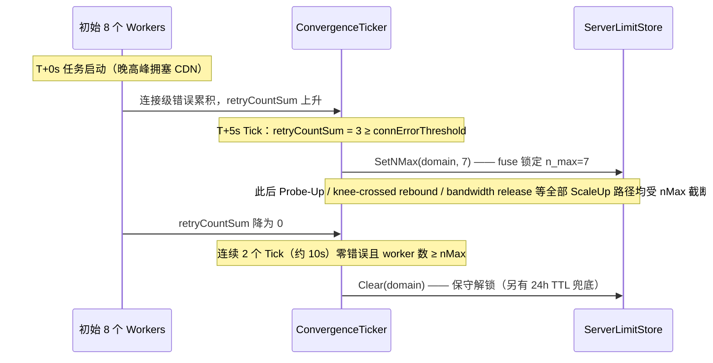

_图4.3：服务端硬限熔断的触发与解锁时序（触发数值来自晚高峰 CDN 拥塞复测的 JSONL 实测日志；解锁段为机制描述）_

### §4.5 带宽借用

第二章 §2.4 的双天花板模型中，$V_{available} = V_{global\_peak} - ReservedBandwidth$。当一个占据了大量保留带宽的旧任务完成时，其 $ReservedBandwidth$ 会被释放回资源池，为其他正在运行的任务触发 ScaleUp 提供了物理基础。带宽借用机制正是这一 $ReservedBandwidth$ 动态释放的运行时实现。

ConvergenceTicker 在每个 Tick 周期通过 `prevActiveGids` diff（`convergence.go:126`）检测消失的任务。当发现某个任务不再出现在活跃集合中时，系统从剩余活跃任务中选举一个受益者执行 ScaleUp。选举条件严格匹配物理环境：受益者的 `domain`、`scope`、`envKey` 必须与消失的任务一致，确保带宽借用发生在同一物理网络环境内。当多个任务满足条件时，系统选择当前 worker 数最低的任务，并通过 `rotationCounter`（`convergence.go:127`）进行公平轮转，避免同一任务反复受益。

为应对 `activeBandwidthProvider` 缓存延迟（1-5 秒），系统引入了 `prevActiveSpeeds` map 进行延迟补偿，确保 $V_{available}$ 的计算不会因缓存陈旧而误判。同时，Tick 内部的 `approvedDelta` 累加器防止同一周期内对同一任务的超卖。

在当前的实现中，带宽借用的 ScaleUp 资格已扩展至所有活跃任务——任何同 scope 的任务均可参与运行时扩展，不再受限于特定任务类型。`kneeFrozen`、`phaseCeilingHit`、`blackout` 等状态升级为全局 ScaleUp 硬门控，确保带宽借用不会在不适当的时机触发。

需要指出的是，该机制已在架构层面实现并集成于源码，尚未在受控基准中触发验证，列为后续工作。基准测试中未出现并发同 scope 下载场景，因此带宽借用事件从未被观测到。

### §4.6 分级内存池

在高吞吐场景下，worker 的 I/O 缓冲区分配成为不可忽视的性能因素。如果每个 worker 都从堆上分配新缓冲区，GC 压力会随线程数和吞吐量线性增长。GoAria 通过 `TieredBufferPool` 三级缓冲池系统（`buffer_pool.go:18-20`）解决这一问题：

| 层级       | 缓冲区大小 | 适用速度区间 |
| ---------- | ---------- | ------------ |
| tierSmall  | 32 KB      | < 10 MB/s    |
| tierMedium | 512 KB     | 10-50 MB/s   |
| tierLarge  | 1 MB       | > 50 MB/s    |

_表4.3：分级内存池参数_

`TierForSpeed`（`buffer_pool.go:81`）根据当前下载速度动态选择合适的 tier。低速场景使用小缓冲区以减少内存占用，高速场景使用大缓冲区以减少系统调用次数。这种分级策略使得缓冲区大小始终匹配实际吞吐水平。

为防止巨型切片长期驻留池中导致内存泄漏，系统设定了 `MaxPoolBufferCap=4MB`（`config.go:25`）：容量超过 4MB 的切片被拒绝入池，直接交由 GC 回收。这一设计源自 Go 运行时 Issue #23199 的修复经验——过大的 sync.Pool 条目会严重干扰 GC 的标记-清除效率。

### §4.7 CDN 节流指纹与微观循环

ConvergenceTicker 以 5 秒为宏观周期进行线程数调整，但 CDN 侧的限流和死连接往往在更短的时间尺度内发生。为此，GoAria 部署了独立的 `CDNDetector` 微观循环，以 1 秒间隔（`cdnDetectorInterval=1s`，`cdn_detector.go:16`）运行。

CDNDetector 维护一套优先决策树，通过分析 per-worker 的速度趋势、HTTP 状态码和重试计数，识别两类问题：单点 CDN 限速（某个 worker 被服务端速率限制）和死连接（worker 长时间无数据传输但 TCP 未断开）。对于前者，系统优先使用 KillWorker 强制重建连接；对于后者，同样使用 Kill 清理。

如前文 §4.2 所述，当同一 worker 被 Kill 达 `cdnMaxKillCount=3` 次后速度仍未改善，系统将其降级为 DrainWorker。这表明问题不是死连接，而是 CDN 侧的系统性速率限制——继续 Kill 只会浪费连接资源，Drain 则保留了 idle 连接供后续复用。

这里需要区分两种不同层面的隔离。第二章 §2.7 概述了 GoAria 与底层执行引擎之间的策略-机制隔离（调度大脑 vs 无状态执行引擎）。而 ConvergenceTicker 与 CDNDetector 之间的双环解耦，则是 GoAria 内部的进一步隔离：宏观环（ConvergenceTicker，5 秒，关注整体吞吐比率）与微观环（CDNDetector，1 秒，关注单 worker 健康状态）之间零状态共享，仅通过物理环境（吞吐量变化）自然传导。微观层 Kill 带来的吞吐量提升，会在约 10 秒后（2 个宏观 Tick 周期）被 `rawBps` 自然反映，宏观层据此做出线程数调整决策。这种松耦合设计避免了两个循环之间的状态依赖和锁竞争。

### §4.8 反论防御

第一章 §1.5 已经回应了“为何不在 TCP 层使用 BBR”的质疑。本章在运行时兜底的语境下，需要进一步回应两个常见的工程质疑。

**质疑一：如果服务端本身就是瓶颈，增加线程数有何意义？**

这正是 §4.4 服务端连接硬限熔断存在的原因。当服务端对单 IP 施加并发连接硬限时，盲目增加线程数不仅无法提升吞吐，反而会触发更严格的限流甚至 IP 封禁。`ServerLimitStore` 通过运行时检测 retry 计数超阈值，动态锁定 $N_{max}$，使线程数收敛在服务端实际承受能力以内。晚高峰 CDN 拥塞复测中 fuse 锁定 `n_max=7` 的实测数据，直接证明了这一防御路径的有效性。

**质疑二：4-8 线程的最优是否只是运气？换一个服务器，最优可能是 32 线程？**

这种质疑假设 GoAria 的线程数是固定值，但实际上它是一个动态收敛的结果。第三章 §3.4 的收敛轨迹展示了三种截然不同的收敛路径：CDN 拥塞场景下 4→6→7→8 的上行探索收敛，千兆局域网场景下 8→7 的下行挤压收敛，以及广域网场景下稳定 5 的静态适配。这些轨迹证明，GoAria 的线程数并非预设常数，而是根据物理网络条件动态探索的结果。运行时的 probe-up 与 ceiling-hit-rebound 机制进一步确保了：即便初始值偏离最优，系统也能在几个 Tick 周期内自主纠偏。

## 第五章：策略与机制的隔离哲学 (Policy-Mechanism Separation Philosophy)

第二章 §2.7 概述了策略与机制隔离的宏观益处。本章将深入展开这一架构哲学的工程实现——从跨界接口的设计到双环解耦的运行时体现，再到隔离原则带来的可验证工程价值。

### §5.1 隔离原则的架构基础

在 GoAria 的架构中，策略层与机制层的职责划分是严格的。GoAria 充当调度大脑，负责 BDP 计算、历史采样查询、降级矩阵决策和线程数收敛——所有涉及“应该开几条连接”的判断都在此完成。底层执行引擎（本白皮书基准测试以 Surge 为底层引擎）则保持无状态，不维护任何历史数据或跨任务统计，仅负责“按照给定的数字开几条 TCP 连接”的机械执行。

跨界接口的设计体现了这一隔离原则。初始调度时，GoAria 的 `Calculate` 函数（`smartthread.go:26`）返回一个 `ThreadParams` 结构体（`smartthread.go:13-19`），仅包含线程数（`Split`）、最小切分大小（`MinSize`）、探索标记（`IsExploration`）、目标带宽（`TargetBandwidth`）和 BBR 饱和并发连接数（`NSat`）五个字段。执行引擎接收到这些数字后，在内存中创建对应数量的 TCP 连接，不多一条，不少一条。

运行时调整阶段，GoAria 通过命令接口（`ScaleWorkers`/`KillWorker`/`SetSlowWorkerThreshold`，分别位于 `downloader.go:823`/`:897`/`:908`）向执行引擎发送调整指令。这些接口虽然涉及运行时动态调整，但保持了逻辑分离：GoAria 决定“调整到几”，执行引擎执行“增加/减少几个 worker”。执行引擎始终不维护任何关于 BBR、网络拥塞或历史峰值的状态——它只是忠实地执行命令。

### §5.2 双环自适应：宏观与微观

第四章 §4.7 已经描述了 ConvergenceTicker（宏观，5 秒）与 CDNDetector（微观，1 秒）的双环解耦机制。本节从架构哲学的角度进一步阐明：双环解耦是 GoAria 内部的宏观/微观分离，与 GoAria-Surge 之间的策略层/机制层分离是不同层面的架构原则。

GoAria-Surge 隔离解决的是“谁来决策”的问题——策略大脑 vs 无状态执行引擎，跨界接口仅传递数字和命令。双环解耦解决的是“决策粒度”的问题——宏观环关注整体吞吐比率和线程数收敛，微观环关注单 worker 健康状态和 CDN 限流指纹。两者之间零状态共享，靠物理环境（吞吐量变化）自然传导，无需显式的事件通知或共享变量。

这种分层隔离带来了显著的工程收益。宏观环的 5 秒周期不会被微观环的 1 秒高频检测所干扰，微观环也不需要等待宏观环的 Tick 才能行动。当 CDN 对某个 worker 施加速率限制时，CDNDetector 能在 1 秒内检测并 Kill 该 worker，而无需等待 5 秒后的 ConvergenceTicker 周期。反之，ConvergenceTicker 的线程数调整决策基于经过微观环清理后的稳定吞吐数据，不会被单 worker 的瞬时异常所误导。

### §5.3 隔离原则的工程价值

隔离原则的价值并非仅停留在架构美感上，它可以被实测数据直接验证。

在白天 CDN 拥塞时段的三方对照测试中，纯执行引擎（Surge 原生行为，无调度大脑）与 GoAria（调度大脑 + 同一执行引擎）的表现形成了鲜明对比：

- "Surge over-scales to 22 threads yet delivers lowest throughput (9.93 MB/s avg) and worst tail latency (17.85s)"
- "GoAria matches aria2c avg speed (18.53 vs 19.07 MB/s) with 1/4 the threads (4 vs 16)"

同一执行引擎，在缺乏调度大脑时扩展至 22 线程却获得最低吞吐和最差尾延迟；在 GoAria 调度下仅用 4 线程便匹配了 aria2c 的吞吐。这一对照直接证明了：执行引擎的并发能力本身并非问题，问题在于缺乏策略层的宏观调度。隔离原则的工程价值，正是让强大的执行能力在正确的调度下发挥效用，而非在盲目扩展中自我消耗。

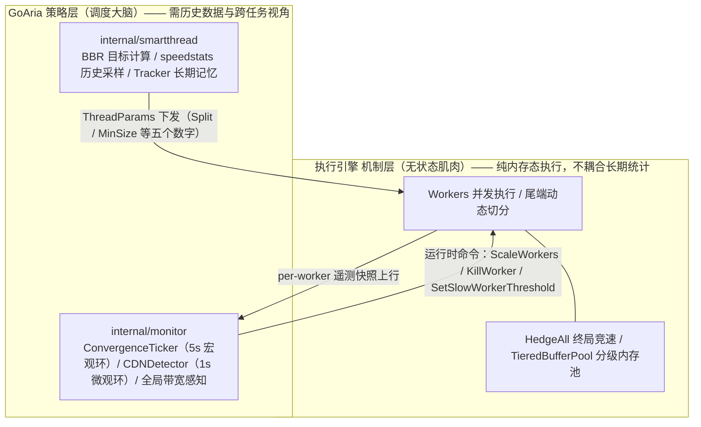

_图5.1：上下游职责边界图。跨界只有两类通信：策略层向下传递数字与命令，机制层向上回传遥测快照。_

## 第六章：实测验证与数据解读 (Benchmark Validation & Data Interpretation)

本章通过完整的实验数据矩阵，对前述各章的理论声称进行严密的实测验证。所有数据均来自受控主体对照测试，按数据采集方式分为两个可信度层级：仪器级 JSONL 结构化日志为强证据，可直接引用；人工记录的观测数据为弱证据，引用时附加数据来源限制声明。两者绝不以同等可信度并列引用。

### §6.1 测试方法论

本次基准测试采用三主体对照设计：

- **主体 A**：aria2c，代表传统的静态固定线程调度（-x16 参数定死）
- **主体 B**：Surge 原生行为，无上层调度，代表缺乏宏观拥塞感知的纯底层并发模型
- **主体 C**：GoAria，BBR 自适应调度 + Surge 执行引擎，代表策略-机制隔离架构

测试覆盖三种网络拓扑：广域网大文件场景、CDN 拥塞场景、千兆局域网极限吞吐场景。共采集 21 个 JSONL 仪器级日志文件，涵盖不同时段和文件大小的交叉验证。

**偏差声明**：以下偏差需诚实记录：

1. 广域网场景通过真实公网链路测试，端点为公开可访问的广域网文件源，链路具备可测量的 RTT 与带宽特征。
2. CDN 拥塞场景使用真实 CDN 的自然晚高峰拥塞（非受控注入式拥塞），拥塞是真实的但缺乏精确的 RTT/丢包注入控制。
3. 速度约定：1 MB/s = 1,000,000 B/s（十进制，非二进制）。

三种网络拓扑的场景特征与测试目的汇总如下：

| 场景                   | 拓扑特征                       | 主要瓶颈                 | 测试目的                              |
| ---------------------- | ------------------------------ | ------------------------ | ------------------------------------- |
| 广域网大文件场景       | 高带宽公网链路，具备可测量 RTT | 带宽上限与 RTT 窗口      | 验证 BBR 调度在好网络下不劣于静态引擎 |
| CDN 拥塞场景           | 真实 CDN 自然晚高峰拥塞        | 服务端速率限制与并发硬限 | 验证自适应收敛、断路器与尾延迟控制    |
| 千兆局域网极限吞吐场景 | 无拥塞内网，单流即可饱和链路   | 磁盘 I/O 与协议开销      | 验证极限吞吐与下行收敛能力            |

_表6.1：测试场景对比汇总_

### §6.2 广域网高带宽基线

广域网场景的测试目的，是验证 GoAria 在高带宽稳定链路下不会劣于 aria2c——这回应了一个常见的反论：“BBR 调度在好网络下是否反而变慢？”

在 538 MB 文件的广域网测试中：

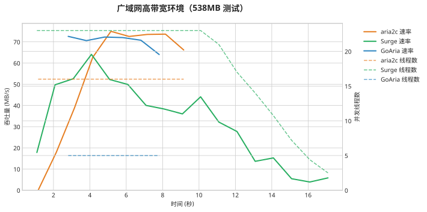
*图 6.1：广域网高带宽环境（538MB 测试）。短时间下载内，GoAria 的少线程快速启动优势得以体现。*

- **广域网大文件（538 MB）**：GoAria 仅用 5 线程便比 16 线程的 aria2c 快 9%（8.72秒 vs 9.60秒）。

在 1.44 GB 文件的广域网测试中：

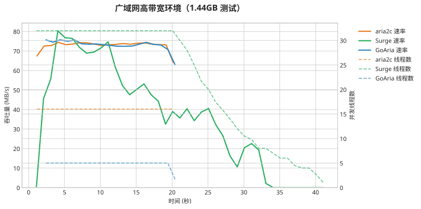
*图 6.2：广域网高带宽环境（1.44GB 测试）。在真实的广域网环境下，GoAria 凭借 BBR 调度，仅用 5 线程就紧紧咬住了 aria2c 的 16 线程性能极限。*

- **广域网大文件（1.44 GB）**：GoAria 仅用 5 线程即匹配了 aria2c 16 线程的吞吐速率（68.71 MB/s vs 70.46 MB/s，差距不到 3%）。

此外，在此 1.44 GB 广域网大文件测试中，GoAria 的单线程效率优势同样明显：

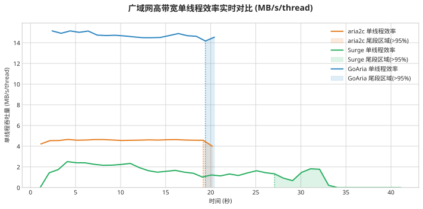
*图 6.3：广域网高带宽单线程效率实时对比 (MB/s/thread)。测试数据显示，即使在无严重拥塞的高带宽公网环境下，GoAria 仍维持了 13.74 MB/s 的单线程吞吐均值（约为对照组的 3.1 倍）。在进度达到 95% 之后的尾段区间，其单线程效率未出现显著衰减，呈现出平稳的收尾特征。*

两轮测试均使用 5 线程匹配或超越 aria2c 的 16 线程表现。这证明 BBR 调度模型在高带宽链路下不会引入性能损失——$V_{thread\_avg}$ 近似在窗口饱和时是精确的，代数化简的代价在此场景下可忽略。

### §6.3 CDN 拥塞与断路器

CDN 拥塞场景是本次测试的核心验证场景，覆盖了白天和晚高峰两个时段，提供了 ConvergenceTicker 收敛、服务端硬限熔断和尾延迟控制的全链路验证。

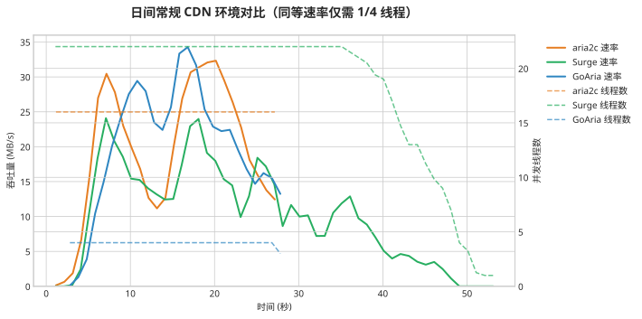
*图 6.4：日间常规 CDN 环境对比。GoAria 仅用 4 线程即匹配了 aria2c 的吞吐速率；而缺乏全局拥塞感知的纯底层并发策略（Surge 原生行为）在扩展至 22 线程后，因触发 CDN 服务器的并发限制与惩罚，遭遇了严重的尾延迟与吞吐下降。这一对照直接验证了策略-机制隔离的工程价值。*

**同 URL 收敛验证**（JSONL 验证）：

- **同文件加速**：GoAria 仅用 6 线程即可比 16 线程的 aria2c 快 38% 完成下载（17.53秒 vs 28.30秒）。
- **跨任务自适应学习**：在同一 CDN 域名的多次历史下载后，Tracker 引导初始线程从 4 自动收敛至 6，使得平均速率飙升 63%（从 18.53 MB/s 提升至 30.21 MB/s），全程无需人工干预。
- **单线程效率倍增**：收敛后的 GoAria 单线程效率达 5.03 MB/s，是 aria2c（1.17 MB/s）的 4.3 倍。

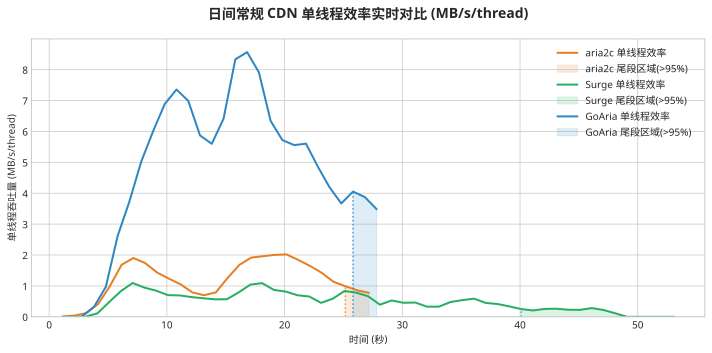
*图 6.5：日间常规 CDN 单线程效率实时对比 (MB/s/thread)。图表显示 GoAria 维持了较高的单线程吞吐效率，反映了 BBR 调度在单流带宽利用率上的优化效果。图中的阴影区域和垂直虚线分别标注了各引擎的尾流段（完成度 >95%）。观测表明，GoAria 在尾流阶段的耗时较短且效率波动较小；相较之下，纯执行引擎在该阶段出现了显著的效率衰减。**这提示我们：在拥塞环境下过度扩展并发线程数（如纯执行引擎），不仅未能成比例提升整体吞吐，反而增加了触发 CDN 服务器并发惩罚（如连接限速或阻断）的风险，进而导致单线程效率出现阶跃式下降**。*

Tracker 在跨文件下载中将线程数从 4 收敛至 6，带来了 63% 的平均速度提升。这一数据验证了第三章 §3.4 的收敛轨迹声称，也验证了第二章 BBR 代数化简的有效性——化简后的公式在真实 CDN 拥塞下依然能指导出比静态 16 线程更优的并发连接数。

**晚高峰 CDN 拥塞复测三方对照**（JSONL 验证）：

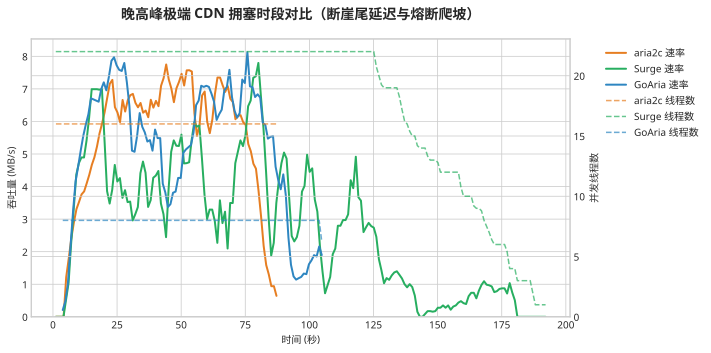
*图 6.6：晚高峰极端 CDN 拥塞时段对比。图表明确展现了服务端硬限熔断的作用，以及无节制并发（如绿线）所导致的断崖式尾延迟。*

- **极端拥塞下的灾难性尾延迟**：在晚高峰 CDN 拥塞下，纯执行引擎扩展至 22 线程，导致长达 72.04 秒的尾延迟（最后几个 worker 虽仅剩极小的数据块，却因服务端单连接限速迟迟无法完成）。
- **服务端硬限熔断**：任务启动约 4.6 秒后，8 个初始 worker 在拥塞节点同时触发重试阈值，熔断器果断将 `n_max` 锁定为 7，成功阻止了线程爆炸。
- **尾段宏观静默**：当剩余 73.66 MB（此时有 8 个 worker）时触发 `blackout` 事件，GoAria 尾段优化介入，收缩宏观调配并为最后冲刺整合 worker 资源。

晚高峰场景下，服务端硬限熔断（`n_max=7`）和尾段宏观静默（`blackout_triggered`）均被 JSONL 日志明确记录。所谓尾段宏观静默（tail blackout zone），是指当剩余字节量低于 chunk worker 数与有效最小分块的乘积时，ConvergenceTicker 永久停止对该任务的宏观线程调整，主动让位于 §4.3 所述引擎侧 End-Game 机制的微观竞速——宏观停手，微观冲刺。GoAria 以 8 线程（fuse 锁定后实际不超过 7）在极端拥塞下维持了 5.01 MB/s 的平均速度，而纯执行引擎的 22 线程仅获得 2.77 MB/s 平均速度和 72.04 秒的尾延迟。

**CDN 拥塞复测首轮与晚高峰复测**（人工记录，仪器级结构化日志尚未覆盖此场景）：

该观测记录来自测试期间人工记录，仪器级结构化日志尚未覆盖此场景。在 CDN 拥塞复测首轮中，GoAria 以 8 线程起步，服务端硬限熔断锁定 `n_max=8`，ConvergenceTicker 执行了完整的 probe-up → ceiling-hit-rebound 周期（8→9→10→11 探测上行，随后 11→10→9 触顶反弹）。在晚高峰复测中，我们人工重置了该域名的部分历史采样，让引擎以 4 线程重新起步（受控对照操作，见 §3.4，非 Tracker 自主回落），ConvergenceTicker 执行了两轮 probe-up → ceiling-hit-rebound 周期（4→5→4，以及 4→5→6→5），尾段宏观静默在剩余 64 MB 时触发。

### §6.4 局域网极速吞吐

局域网场景验证了 GoAria 在无拥塞的极限吞吐条件下的表现。如第三章 §3.5 所述（commit 51dee21），Preallocate Fix 引入的稀疏文件降级回退机制消除了 Windows 平台下约 2.5 秒的启动迟滞。Post-fix 数据才是剥离了操作系统 I/O 损耗后的真实能力体现。

**冷启动（Pre-fix）**（JSONL 验证）：

- **冷启动优势（Pre-fix）**：即使在文件预分配修复前，GoAria 仅用 8 线程即比 16 线程的 aria2c 快 17%（20.13秒 vs 24.37秒，平均速率 279.49 MB/s vs 230.93 MB/s）。

**热启动（Pre-fix）**（JSONL 验证）：

- **热启动优势（Pre-fix）**：在同样打满带宽的情况下（268.11 MB/s vs 266.78 MB/s），GoAria 仅用 8 线程即匹配了纯执行引擎 32 线程的表现，且尾延迟降低 1.8 倍（1.17秒 vs 2.09秒）。

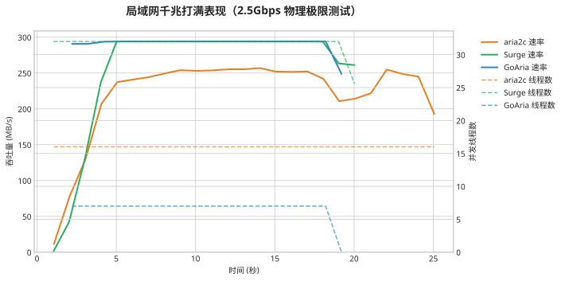
*图 6.7：局域网千兆打满表现（2.5Gbps 物理极限测试）。Post-fix 数据显示，GoAria 以 7 线程饱和了 2.5Gbps 链路的 92.9%（平均 290.33 MB/s），整体耗时比 16 线程的 aria2c 缩短了 23%（19.38s vs 25.12s）。如图中蓝线所示，在修复了预分配迟滞问题后，GoAria 的实时速率迅速攀升至接近 294 MB/s 的物理有效载荷上限，并在此后保持高度稳定的直线输出。同时，Tracker 在此场景下主动执行了下行收敛（8→7 线程），削减了冗余并发。*

为进一步突显极致吞吐环境下的引擎效能，下图展示了局域网极限测试中的单线程效率对比：

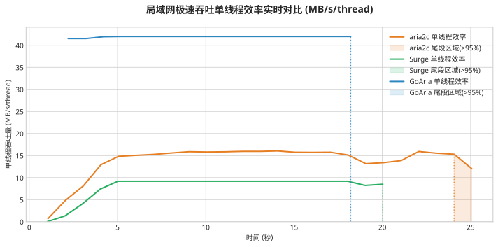
*图 6.8：局域网极速吞吐单线程效率实时对比 (MB/s/thread)。在 2.5Gbps 链路下，GoAria 的单线程效率稳态维持在约 41 MB/s/thread，相较于 16 线程的 aria2c 对照组（约 14-15 MB/s/thread）表现出显著差异。这一对比验证了基于内存池化与无锁设计的底层引擎能够在高吞吐场景下有效降低单线程开销，从实证角度支持了“动态调配少量高效线程”相比“静态分配大并发线程”具备更高的工程收益。*

### §6.5 每线程效率汇总

以下表格汇总了所有测试场景下三个主体的每线程效率（平均速度 / 线程数），以及 GoAria 相对 aria2c 的倍率：

| 场景                    | A (aria2c) MB/s/thread | B (Surge) MB/s/thread | C (GoAria) MB/s/thread | C vs A |
| ----------------------- | ---------------------- | --------------------- | ---------------------- | ------ |
| 广域网 (538 MB)         | 3.51                   | 1.34                  | 12.35                  | 3.52×  |
| 广域网 (1.44 GB)        | 4.40                   | 1.09                  | 13.74                  | 3.12×  |
| 局域网 (冷启动 pre-fix) | 14.43                  | —                     | 34.94                  | 2.42×  |
| 局域网 (热启动 pre-fix) | —                      | 8.34                  | 33.51                  | —      |
| 局域网 (post-fix)       | 14.00                  | —                     | 41.48                  | 2.96×  |
| CDN 拥塞 (白天)         | 1.19                   | 0.45                  | 4.63                   | 3.89×  |
| CDN 拥塞 (收敛后)       | 1.17                   | —                     | 5.03                   | 4.30×  |
| CDN 拥塞 (晚高峰)       | 0.38                   | 0.13                  | 0.63                   | 1.66×  |

_表6.2：每线程效率汇总表_

表中 `—` 表示该主体在该场景下未运行测试。GoAria 的每线程效率在所有场景下均高于 aria2c，倍率从 1.66× 到 4.30× 不等。即使在晚高峰最恶劣条件下，GoAria 每线程效率仍为 aria2c 的 1.66×，证明 BBR 调度在极端拥塞下仍保持了鲁棒性。

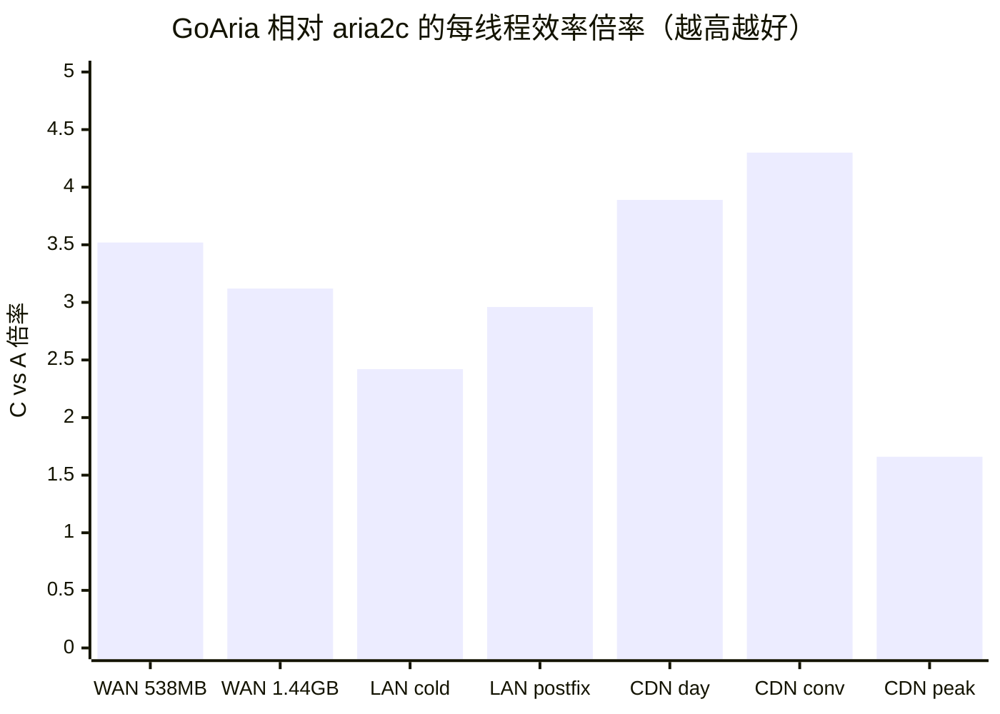

_图6.1：GoAria 相对 aria2c 的每线程效率倍率（数据取自表6.2 的 C vs A 列；局域网热启动行无 A 对照，未入图，全量数据以表6.2 为准）_

### §6.6 收敛轨迹汇总

如第三章 §3.4 所述，Tracker 收敛轨迹体现的是初始线程数的跨下载学习。本节汇总三种网络拓扑下的收敛路径，验证环境感知与自适应收敛的有效性。

**CDN 拥塞场景的上行探索收敛**：Tracker 在跨文件下载中将线程数从 4 逐步收敛至 6、7、8。晚高峰复测轮以 4 线程重新起步——该起点源于我们人工重置部分历史采样的受控对照操作（见 §3.4），而非 Tracker 的自主回落；该轮的价值在于验证了 ConvergenceTicker 的运行时纠偏在极端拥塞下依然有效（见下文两轮 probe-up → ceiling-hit-rebound 周期）。

**千兆局域网场景的下行挤压收敛**：Tracker 从 8 线程稳步回落至 7 线程，发现 7 线程即可饱和 2.5Gbps 链路后主动减少了并发连接数。这是向下收敛的典型案例——系统学会了用更少的资源实现相同的吞吐。

**广域网场景的静态稳定**：Tracker 在两次跨 session 的下载中始终稳定输出 5 线程，拒绝无意义的波动。这表明当链路条件稳定时，BBR 公式的计算已经精确命中最优解，无需进一步探索。

**ConvergenceTicker 运行时探测周期**（人工记录，仪器级结构化日志尚未覆盖此场景）：在 CDN 拥塞复测首轮中，ConvergenceTicker 执行了 8→9→10→11 的 probe-up 探测，随后因触顶执行 11→10→9 的 ceiling-hit-rebound 回退。在晚高峰复测中，系统执行了两轮完整的 probe-up → ceiling-hit-rebound 周期（4→5→4，以及 4→5→6→5）。这些观测记录来自测试期间人工记录，仪器级结构化日志尚未覆盖此场景。

三种拓扑的收敛轨迹与证据来源汇总如下：

| 场景                 | 初始线程数收敛轨迹 | 收敛方向 | 证据来源                             |
| -------------------- | ------------------ | -------- | ------------------------------------ |
| CDN 拥塞（同一域名） | 4 → 6 → 7 → 8      | 上行探索 | 第 1、2、4 轮 JSONL；第 3 轮人工记录 |
| 千兆局域网           | 8 → 7              | 下行挤压 | 全部 JSONL                           |
| 广域网               | 5 → 5              | 静态稳定 | 全部 JSONL                           |

_表6.3：三种网络拓扑下的 Tracker 初始线程数收敛轨迹汇总（CDN 轨迹的可视化见图3.2）_

### §6.7 特殊事件

基准测试中观测到的特殊事件按数据来源分层记录如下。

**服务端硬限熔断**（JSONL 验证）：在晚高峰 CDN 拥塞复测中，`server_limit_fuse` 在启动后约 5 秒触发，`n_max=7, retry_count_sum=3`。所有 8 个初始 worker 同时遭遇 CDN 端的连接级错误，fuse 锁定后阻止了进一步的线程扩展。

**尾段宏观静默**（JSONL 验证）：在同一场景下，`blackout_triggered` 在剩余 73.66 MB 时触发（当时 8 个 chunk worker，有效最小分块 12.08 MB），ConvergenceTicker 自此停止对该任务的宏观线程调整，尾段交由 §4.3 的 End-Game 机制收尾（语义定义见 §6.3）。

**带宽借用事件**：所有 JSONL 日志中均未出现 `bandwidth_borrow` 事件，因为测试中未出现并发同 scope 下载场景；该机制的验证状态详见 §4.5 末段声明。

**CDN 拥塞复测首轮与晚高峰复测事件**（人工记录，仪器级结构化日志尚未覆盖此场景）：在 CDN 拥塞复测首轮中，服务端硬限熔断锁定 `n_max=8`，ConvergenceTicker 执行了完整的 probe-up → ceiling-hit-rebound 周期。在晚高峰复测中，尾段宏观静默在剩余 64 MB 时触发，ConvergenceTicker 执行了两轮 probe-up → ceiling-hit-rebound 周期。该观测记录来自测试期间人工记录，仪器级结构化日志尚未覆盖此场景。

### §6.8 实证局限与数据边界声明

为确保读者对实证证据的边界有准确判断，以下局限需明确声明。表中“对结论的影响”一列说明该局限如何约束本文结论的可信度范围：

| 局限维度                | 现状                                                                      | 对结论的影响                                                                                                             |
| ----------------------- | ------------------------------------------------------------------------- | ------------------------------------------------------------------------------------------------------------------------ |
| Bufferbloat 表征精度    | 以真实 CDN 自然拥塞观测代替受控注入                                       | RTT 与丢包率为观测值而非受控变量，Bufferbloat 的量化结论应理解为真实场景下的趋势性表征，而非精确的因果量化               |
| 内核级 TCP 指标可观测性 | TCP 重传率与路由器队列深度无法从应用层直接采集                            | BBR 模型以 $V_{thread\_avg}$ 作为代理变量，相关收敛性结论建立在代理量而非内核直测量之上，eBPF 级遥测可进一步提升校准精度 |
| 带宽借用机制验证        | 已实现并集成于源码，但未在当前基准场景中触发                              | §4.5 的带宽借用机制以理论描述与源码验证为支撑，尚无运行时实验证据（验证状态详见 §4.5 声明）                              |
| 探测周期轨迹数据来源    | §4.1 与 §6.6 引用的 probe-up/ceiling-hit-rebound 轨迹来自测试期间人工观测 | 仪器级 JSONL 日志尚未覆盖该场景，相关轨迹的精度受人工记录限制，结构化仪器化列为后续工作                                  |

_表6.4：实证局限与数据边界声明表_

完成时间与尾延迟的可视化对比，分别见图1.1 与图4.2。

## 第七章：结语与开源指引 (Conclusion & Open Source Guide)

### §7.1 核心贡献总结

正如第一章 §1.3 所指出的，传统下载引擎面临“固定线程数僵化”与“无大脑盲目过扩”两种失败模式。GoAria 通过以下五项核心贡献，同时解决了这两种失败模式：

1. **BBR 理论指导的应用层线程数适配**（第二章）：通过代数化简将 BDP 公式上卷为可直接操作的线程数计算，用可测量的 $V_{thread\_avg}$ 替代需主动探测的 $RTprop$，在保持物理合理性的同时消除了 RTT 测量噪声的干扰。

2. **运行时多重兜底**（第四章）：ConvergenceTicker 比率纠偏、服务端硬限熔断、End-Game Hedge、轻量排空等机制，构成了对代数化简代价的动态补偿，确保静态公式在动态网络中依然收敛。

3. **策略-机制隔离**（第五章）：调度大脑与无状态执行引擎的彻底分离，使强大的并发能力在正确的调度下发挥效用，而非在盲目扩展中自我消耗。

4. **环境感知与自适应收敛**（第三章）：网关 MAC Hash 物理隔离和 Tracker 跨下载学习，使引擎能够区分不同物理网络并在多次下载中自主逼近最优线程数。

5. **实测验证**（第六章）：以 1/3 至 1/4 的线程开销实现同等或更优的吞吐表现，每线程效率为 aria2c 的 1.66× 至 4.30×。

### §7.2 未来工作

以下方向尚未在本文基准测试中覆盖，列为后续工作：

1. **带宽借用验证**：设计并发同 scope 下载场景，验证带宽借用机制的运行时行为（回引第四章 §4.5）。

2. **受控 Bufferbloat 量化**：使用 Clumsy 注入 50ms RTT + 1% 丢包，采集 TCP 重传率与路由器队列延迟，为第一章 §1.2 的 Bufferbloat 理论动机提供受控实验数据支撑。

3. **源站连接硬限的受控验证**：在已知会触发 HTTP 429 限流的源站上，对比固定线程数引擎触发限流报错 vs GoAria 熔断锁定的行为差异（回引第四章 §4.4）。

4. **ConvergenceTicker 探测周期仪器化**：在 JSONL 日志中记录 probe-up/ceiling-hit-rebound 事件的线程数变更原因，替代当前的人工观测记录（回引第四章 §4.1）。

5. **更多网络环境验证**：在不同 ISP、不同 CDN 提供商、移动网络条件下验证 Tracker 收敛行为的普适性（回引第三章 §3.4）。

6. **eBPF 级网络遥测集成**：探索通过 eBPF 采集内核级 TCP 重传率和 RTT 分布，为 BBR 模型的 $V_{thread\_avg}$ 近似提供更精确的物理量校准。

### §7.3 开源参与指引

GoAria 以开源方式发布，社区可通过以下途径参与贡献：

- **新场景测试**：在不同网络拓扑和 CDN 提供商下复现本文的基准测试，提交测试数据以扩展收敛行为的验证覆盖面。
- **CDN 指纹规则**：贡献新的 CDN 限流检测规则和 worker 健康判定逻辑，增强 CDNDetector 的微观循环覆盖范围。
- **收敛策略优化**：改进 ConvergenceTicker 的状态机参数和 probe 策略，探索更高效的收敛路径。

### §7.4 发布与可复现性

本白皮书与 GoAria 源代码以开源方式共同发布于 GitHub 仓库，读者可对照源码验证本文描述的架构与机制。仓库的 Git 提交历史为所述架构的公开时间点提供了可验证的记录，任意 commit 的 SHA-1 摘要均可作为该时间点技术方案已公开的密码学证据。

白皮书的 Markdown 源文件为权威版本，LaTeX 数学公式在 GitHub 上原生渲染；如需排版打印版本，可通过 Pandoc 将 Markdown 转换为 PDF。项目欢迎社区通过仓库的 issue 与 pull request 进行复现验证、问题反馈与贡献讨论。代码即证据，数据即论据——本文的每一条声称，都欢迎被复现，也欢迎被质疑。

## 参考文献 (References)

1. **Cardwell, N., Cheng, Y., Gunn, C. S., Yeganeh, S. H., & Jacobson, V. (2016).** _BBR: Congestion-based congestion control_. Communications of the ACM, 60(2), 58-66.
2. **Gettys, J., & Nichols, K. (2011).** _Bufferbloat: Dark buffers in the Internet_. Communications of the ACM, 55(1), 57-65.
3. **Hacker, T. J., Noble, B. D., & Athey, B. D. (2002).** _Improving throughput and maintaining fairness using parallel TCP_. IEEE INFOCOM.
4. **Alrshah, M. A., & Othman, M. (2015).** _Performance evaluation of parallel TCP, and its impact on bandwidth utilization and fairness in high-BDP networks_. arXiv preprint arXiv:1510.07839.
5. **Choffnes, D., Lange, J., Rossoff, S., & Kuzmanovic, A. (2006).** _On the Use of Parallel Connections in Web Browsers_. Northwestern University.
6. **Waveform. (2024).** _Bufferbloat Test_. https://www.waveform.com/tools/bufferbloat
7. **Sundaresan, S., et al. (2014).** _A Measurement Study of Bufferbloat in Residential Broadband Networks_. ICSI Netalyzr.
8. **Huston, G. (2020).** _Bufferbloat may be solved, but it’s not over yet_. APNIC Blog.
9. **Ha, S., Rhee, I., & Xu, L. (2008).** _CUBIC: a new TCP-friendly high-speed TCP variant_. ACM SIGOPS Operating Systems Review.
10. **Ivanov, A. (2019).** _Evaluating BBRv2 on the Dropbox Edge Network_. Dropbox Tech Blog.
11. **Hock, M., Bless, R., & Zitterbart, M. (2017).** _Experimental Evaluation of BBR Congestion Control_. 2017 IEEE 25th International Conference on Network Protocols (ICNP).
12. **Journal of Communications (JOCM). (2019).** _Quantifying the Impact of Multiple TCP Connections and Network Fairness in CUBIC and QUIC Emulation_.
